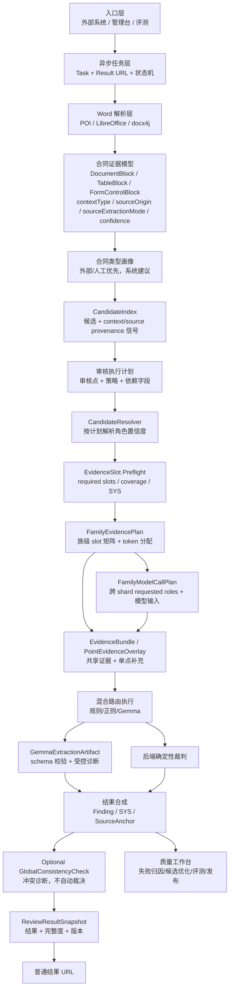

# 合同质量控制中台 V2 架构设计 v0.11

日期：2026-07-24

状态：Draft for implementation planning review - architecture hardening, ADR-016 and ADR-017 incorporated

## 1. 背景

V2 是一个全新的 Contract Quality Control Platform / 合同质量控制中台项目，采用新仓库、新工程上下文启动。本文档不以现有 `ai-contract-review` 项目的代码、目录、页面、任务板、历史规则或样本作为默认工程基础。

V2 的设计目标来自此前审核质量恢复审计中暴露出的共性问题，但这些问题只作为架构约束来源，不意味着新项目继承旧实现。新项目应从合同质量控制中台的产品定位、证据原则、模型边界、结果可解释性和治理闭环重新建模。

V2 的核心约束包括：

- 长合同审核不能依赖“全文合同 + 全部审核点 + 模型一次性裁判”。
- EvidencePacket 不足时不得静默回灌全文，也不得生成无可靠证据的业务 finding。
- `SYS-*` 系统诊断必须和业务风险 finding 分流。
- 普通结果页需要围绕“审核点 -> 证据 -> 原文定位”解释，而不是只展示模型结论。
- Gemma/A30 默认负责局部抽取、证据选择和复杂语义辅助；结构化比对和确定性最终裁判由后端完成。
- 用户无法长期手工调 prompt、正则和规则，因此平台必须具备质量治理、评测和发布门禁。

现有 `ai-contract-review` 项目仅作为可选历史参考源。任何旧项目经验、页面风格、样本、规则或反例，如需进入 V2，必须由产品或实现阶段明确提出，并通过单独迁移任务定点提取；不得默认继承。

## 2. 产品定位

V2 的产品定位是：

> Contract Quality Control Platform / 合同质量控制中台。

平台接收外部系统或管理台发起的合同审核任务，统一完成合同解析、证据索引、审核点计划、规则/正则/Gemma 混合审核、后端裁判、结果快照和质量优化闭环。

平台只提供风险提示、证据和审核结果 URL，供 SAP/OA/人工审批参考。平台不批准、不拒绝、不阻断、不修改审批流。

入口可以有多个：

- 外部系统入口：SAP、OA、采购系统或其他业务系统通过 API 提交任务。
- 管理台入口：内部用户上传 Word 合同、录入结构化字段、选择合同类型和规则集后发起审核。
- 评测入口：内部质量验证任务，用于样本集和候选优化评测。

所有入口必须进入同一套审核链路，不允许 SAP-only 或管理台-only 审核路径。

## 3. 一期范围

一期目标是企业内部低频、高质量审核，重点跑通单份中文 Word 合同的审核质量。

一期支持：

- 中文 `.docx` / `.doc` 合同。
- `.doc` 支持：一期技术能力已设计（LibreOffice headless 转换链路），但 MVP 阶段暂不对外开放；管理台上传界面必须标注“当前仅支持 DOCX”；`.doc` 能力在 Pilot 或之后阶段激活。
- 6 万字左右长合同。
- 合同正文、附件、表格、标题、目录、Word 控件、复选框、单选框。
- 外部系统或管理台提供的结构化字段。
- 工程合同、材料供货合同、费用合同、杂项合同的粗分类。
- 规则/正则/Gemma 混合路由。
- 本地 A30/Gemma 生产辅助。
- 公网模型用于离线质量优化，不直接决定生产 finding。
- 异步任务、单 worker 顺序处理、结果 URL、最终结果快照。
- 普通结果页左侧合同原文、右侧审核点，点击右侧审核点定位左侧证据。

一期不做：

- PDF/OCR 作为主输入能力。
- 大规模多合同并行调度。
- RabbitMQ/Kafka 或分布式 worker。
- 多租户。
- 复杂企业 IAM。
- 开放式聊天问答审合同。
- 自动发布 prompt、正则、规则。
- 复杂 BI 报表。
- 全文向量 RAG 主链路。

PDF 可作为 Word 转换后的内部预览形态使用，但不作为一期用户输入主能力。

## 4. 核心架构



核心原则：

- 一次解析、一套索引、多审核点共享证据。
- 项目主定位保持为 Contract Quality Control Platform / 合同质量控制中台，不改为 AI 合同审核平台。模型会变化，但 EvidenceSlot、CandidateResolver、ReviewPointFamily 和 Tuning Governance 是长期资产。
- `contextType`、`sourceOrigin`、`sourceExtractionMode` 和区域置信度从解析产物进入 CandidateIndex，并继续参与 EvidenceRankScore、exclusion policy、CandidateResolver 和 EvidenceSlot coverage；不得在索引层丢弃这些 provenance 元数据。
- 图中的 `审核执行计划` 即 `ReviewExecutionPlan`，执行顺序固定为 `CandidateIndex -> ReviewExecutionPlan -> CandidateResolver`；`FamilyModelCallPlan` 在 `FamilyEvidencePlan` 汇总跨 shard 模型需求后生成，不反向影响静态审核计划。
- 合同类型画像在 CandidateIndex 前确定为“路由 profile”；外部或人工类型优先，系统自动建议只作为 hint。CandidateIndex 可以使用 `ContractTypeProfile` 的词库和 profile boost，但仍保持高召回，不因合同类型过滤掉通用候选。
- 审核点不重复扫描 6 万字全文。
- Gemma 不吃整份合同，不一次性裁判全部审核点。
- 能确定的交给规则/正则/后端裁判。
- 不能确定的交给 Gemma 做局部抽取或语义辅助。
- 最终 `PASS`、`WARNING`、`ERROR`、`SYS-*` 由后端统一合成。
- 所有规则、正则、prompt、模型、合同类型画像和 EvidenceSelector 必须版本化。

### 4.1 双链路隔离

平台必须将正式生产审核链路和调优治理链路彻底隔离。

生产审核链路：

```text
Contract
-> Parser
-> CandidateResolver
-> EvidenceSlot
-> Review Engine
-> Finding
-> ReviewResultSnapshot
```

生产审核链路原则：

- 稳定。
- 可解释。
- 可审计。
- 证据不足不生成业务 finding。
- 后端负责最终点级裁判。
- 模型只做局部抽取、证据选择、候选归属或语义辅助。

调优治理链路：

```text
ReviewResultSnapshot
-> TuningPacket
-> CrossModelDiagnostic
-> AITuningAdvice
-> Candidate Change
-> Regression Validation
-> Human Approval
-> Release
```

调优治理链路原则：

- 实验。
- 诊断。
- 优化。
- 治理。

核心红线：

```text
AI Advice != Production Change
```

任何 AI 建议不得直接修改 prompt、rule、CandidateResolver、EvidenceSlot、ModelProfile 或后端确定性裁判，不得影响当前正式 `ReviewResultSnapshot`。AI 建议必须先进入候选变更，经过回归验证、人工批准和版本发布后，才可能影响后续新建任务。

MVP 只建设 Tuning Packet、PointDiagnostic、ExecutionSummary 和导出配置，支持人工复制诊断包给 DeepSeek、ChatGPT、Claude 或其他 AI 辅助分析；不自动调用公网 AI，不自动调优，不自动改规则。

Pilot 再建设 CrossModelDiagnostic、CrossModelComparison 和结构化 AITuningAdvice，但仍只生成候选建议，不自动生效。

Production Readiness 再建设 Regression Center、Release Governance、Rollback、Audit 和 OptimizationEffect。

## 5. Word-first 文档解析

一期输入范围是 Word，但技术过程中可以将 Word 转换为适合预览和定位的中间形态。

推荐开源库组合：

| 能力 | 开源库 | 说明 |
| --- | --- | --- |
| `.docx` 段落/表格/样式解析 | Apache POI XWPF | 主解析器 |
| `.doc` 支持 | LibreOffice headless | 转 `.docx` 后进入主解析链路 |
| WordprocessingML / content controls / checkbox 辅助 | docx4j | 补充 POI 对控件解析的不足 |
| 通用文本/metadata 兜底 | Apache Tika | 交叉校验，不作为主解析 |
| Word 预览转换 | LibreOffice headless | 转 PDF/HTML 供左侧预览 |

解析产物：

```text
ContractDocument
- metadata
- blocks: DocumentBlock[]
- tables: TableBlock[]
- controls: FormControlBlock[]
- sections: SectionTree
- regions: RegionIndex
- indexes: ContractIndex
- parseQualityReport: ParseQualityReport
```

`DocumentBlock` 一期字段：

```text
DocumentBlock
- blockId
- type: HEADING / PARAGRAPH / TABLE_ROW / APPENDIX_TITLE / TOC_ITEM
- text
- normalizedText
- sectionPath
- regionType
- contextType: NORMAL / EXAMPLE / EXPLANATION / HISTORY / HEADER_FOOTER / DELETED / VOIDED / TOC
- sourceOrigin: NATIVE_WORD / LIBREOFFICE_CONVERSION / PREVIEW_ONLY
- sourceExtractionMode: STRUCTURED / TEXT_FALLBACK / PREVIEW
- sourceFileId
- tableId?
- rowIndex?
- blockConfidence
```

`blockConfidence` 与第 22 节的区域级置信度是同一体系；表格、控件和区域分别使用 `tableConfidence`、`controlConfidence`、`regionConfidence`。文档中如出现旧名 `confidence`，应理解为对应 block/anchor 的置信度摘要，不另建第二套置信度模型。

解析器必须尽力输出 `contextType`，使示例、说明、历史值、目录、页眉页脚和作废/删除区域可以参与 exclusion policy。识别只使用可解释的结构/显式信号，例如 heading/style、明确的“示例/说明/历史版本”标签、Word revision/deletion 标记、页眉页脚关系和 TOC 结构；一期不使用不可解释的语义分类器猜测 `contextType`。无法可靠识别时使用 `NORMAL` 并写入 `CONTEXT_TYPE_UNCERTAIN` warning，不得凭空标为强排除区域。

`CONTEXT_TYPE_UNCERTAIN` 的处理规则：

```text
- 不生成基于 contextType 的 weak/strong exclusion penalty
- 其他独立信号仍可生效，例如互斥 role label、value type/unit 不兼容
- 候选保存 contextTypeConfidence=LOW 和 warning code
- required/critical slot 若只依赖此类候选，最高解析归属为 MEDIUM
```

`sourceOrigin=PREVIEW_ONLY` 的内容不得进入业务裁判。`LIBREOFFICE_CONVERSION` 表示内容经过 LibreOffice 转换，不等同于左侧视觉预览：

```text
STRUCTURED:
- 转换为 docx 后仍由 POI/docx4j 读取结构
- 默认最高 MEDIUM；通过段落/表格计数、文本长度和关键结构交叉校验后可提升

TEXT_FALLBACK:
- 只能从转换产物提取扁平文本
- 强制 LOW，不能单独支持 HIGH role resolution、PROVEN_REQUIRED_CLAUSE_ABSENT 或确定性 ERROR

PREVIEW:
- 仅用于显示，不进入候选、索引或裁判
```

合法组合矩阵：

| sourceOrigin | sourceExtractionMode | 是否进入 CandidateIndex | blockConfidence 上限 |
| --- | --- | --- | --- |
| `NATIVE_WORD` | `STRUCTURED` | 是 | `HIGH` |
| `NATIVE_WORD` | `TEXT_FALLBACK` | 是 | `LOW` |
| `LIBREOFFICE_CONVERSION` | `STRUCTURED` | 是 | 默认 `MEDIUM`，满足结构交叉校验可为 `HIGH` |
| `LIBREOFFICE_CONVERSION` | `TEXT_FALLBACK` | 是 | `LOW` |
| `PREVIEW_ONLY` | `PREVIEW` | 否 | 不适用 |

其他组合非法并产生 parser diagnostic。`LIBREOFFICE_CONVERSION + STRUCTURED` 提升为 `HIGH` 必须同时满足：

```text
- 转换后由 POI/docx4j 成功读取段落、表格和 section 结构
- 转换前后可观测正文文本长度差异 <= 5%
- 表格数、表格行数和控件数不存在未解释的下降
- 标题/附件边界可定位，且无 PARSER_STRUCTURE_MISMATCH warning
- 抽样 anchors 可回到同一 source file 的预览位置
```

任一条件不满足时最高为 `MEDIUM`；若只能提取扁平文本则强制 `TEXT_FALLBACK + LOW`。

这里的“预览位置”指平台由同一 source file 生成的 LibreOffice PDF/HTML preview，不是原始 Word 二进制内部坐标。转换后结构化 block 必须保存 `previewAssetId + previewPage/elementRef + blockId` 映射；该映射用于左侧忠实渲染预览定位。

映射失败时按以下方式降级：

```text
exact text/element mapping -> EXACT_TEXT_RANGE or BLOCK_LEVEL
only converted page known -> PAGE_LEVEL
only section known -> SECTION_LEVEL
no reliable mapping -> UNAVAILABLE
```

定位降级本身不改变已形成的业务结论，但结果页必须提示“仅能定位到转换预览页/章节”。依赖精确范围的 `sourceAnchorPolicy` 若未达到最低定位等级，则该点 `NOT_CONCLUDED`；`TEXT_FALLBACK` 不得生成 `EXACT_TEXT_RANGE`。

`PREVIEW_ONLY` 只能由平台 parser/preview pipeline 生成，调用方不得在任务 API 中提交或标记 `DocumentBlock`。其来源是仅成功生成可视预览、但没有获得可裁判文本/结构的转换产物；平台仍保存 preview asset 和 parser diagnostic。

`TableBlock` 一期字段：

```text
TableBlock
- tableId
- sourceFileId
- sectionPath
- regionType
- rows: TableRowBlock[]
- hasMergedCells
- hasNestedTable
- tableConfidence
- warnings
```

`FormControlBlock` 用于 Word 单选框、复选框、content controls 和符号型勾选：

```text
FormControlBlock
- blockId
- controlType: CHECKBOX / RADIO / CONTENT_CONTROL / SYMBOL_CHECK / TEXT_FIELD
- label
- value: checked / unchecked / selectedOption / text
- nearbyText
- tableId?
- rowIndex?
- sectionPath
- controlConfidence
- warnings
```

控件值进入 `ControlIndex` 时保留 `controlConfidence`：

```text
HIGH:
- 原生 content control/checkbox 状态明确，label 关联稳定
- 可参与 HIGH role resolution

MEDIUM:
- 符号勾选或转换后结构可恢复，但 label/option 关联需规则推断
- 最高形成 MEDIUM candidate，可进入 Gemma ambiguity assist

LOW:
- checked/unchecked、选项归属或附近 label 无法可靠确认
- 只能作为辅助候选，不得成为 HIGH role、确定性 PASS/ERROR 或单独满足 critical EvidenceSlot
```

同一控件若 `value` 可读但 `label` 不可靠，整体 candidate 取二者较低置信度。CandidateResolver 不得因 `value=checked` 就忽略 LOW `controlConfidence`。

解析质量必须产出 `ParseQualityReport`：

```text
ParseQualityReport
- fileType
- parser
- language: zh-CN
- textLength
- blockCount
- headingCount
- tableCount
- formControlCount
- appendixRegionCount
- tocDetected
- amountCandidateCount
- partyCandidateCount
- ratioCandidateCount
- parseStatus: GOOD / PARTIAL / LOW_CONFIDENCE / FAILED
- confidenceSummary
- lowConfidenceRegionCount
- lowConfidenceBlockCount
- lowConfidenceTableCount
- lowConfidenceControlCount
- warnings
```

`confidenceSummary` 是解析阶段输出的区域级摘要；第 22 节的 `lowConfidenceRegionImpact` 在审核执行阶段结合 `ParseQualityReport`、审核计划和 EvidenceSlot 计算，不要求解析器直接知道 core review point。

`confidenceSummary` 结构：

```text
confidenceSummary
- highBlockCount
- mediumBlockCount
- lowBlockCount
- highTableCount
- mediumTableCount
- lowTableCount
- highControlCount
- mediumControlCount
- lowControlCount
- lowConfidenceRegionTypes[]
- warningCountsByCode
```

不同 parser adapter 必须输出同一结构；无法计算的字段用 `UNKNOWN`，不得伪造为 0。

`lowConfidenceRegionTypes[]` 使用固定枚举：

```text
BODY
TABLE
FORM_CONTROL
APPENDIX
HEADER_FOOTER
PREVIEW_CONVERSION
UNKNOWN
```

某区域只要包含 LOW block/table/control 或对应 warning code，即计入该 region type；同一类型去重。

`PREVIEW_CONVERSION` 仅用于标记 `sourceOrigin=LIBREOFFICE_CONVERSION + sourceExtractionMode=TEXT_FALLBACK`，或转换结构校验失败后被降为 LOW 的区域。它不是“预览页面质量”，也不要求从渲染截图反向解析文本。

解析质量门禁：

- `GOOD`：可进入完整审核。
- `PARTIAL`：可审核，但低置信审核点应标注。
- `LOW_CONFIDENCE`：只跑基础规则，复杂点输出 `SYS-PARSE-LOW-CONFIDENCE`。
- `FAILED`：不输出业务风险，只提示解析失败。

如果解析产物只有 `PREVIEW_ONLY` / `sourceExtractionMode=PREVIEW` blocks，且不存在任何可用于合同证据的 `NATIVE_WORD` / `LIBREOFFICE_CONVERSION` block，则合同内容解析状态必须为 `FAILED`；可以保留外部结构化输入自身的一致性诊断，但不得生成基于合同正文的 PASS/WARNING/ERROR。若存在少量可裁判 block、其余仅可预览，则至少为 `LOW_CONFIDENCE`，只允许未依赖缺失区域的确定性规则继续执行。

## 6. 中文证据索引

解析完成后，系统一次性构建中文合同证据索引。索引不是最终裁判，只为审核点提供候选证据。

一期索引：

- `AmountIndex`：金额、单位、大小写金额、含税/不含税/税额 hint。
- `RatioIndex`：付款比例、税率、违约金比例、质保金比例。
- `PartyIndex`：甲方、乙方、发包人、承包人、买方、卖方、委托方、供应商。
- `DateIndex`：合同日期、工期、付款期限、质保期。
- `PaymentTermIndex`：预付款、进度款、竣工款、结算款、尾款。
- `HeadingIndex`：章节标题、条款标题、附件标题。
- `TocIndex`：目录项。
- `AttachmentIndex`：附件、附表、承诺函、工程量清单等区域。
- `SensitiveInfoIndex`：手机号、身份证、银行卡、邮箱、统一社会信用代码等。
- `ControlIndex`：复选框、单选框、content controls 的候选值。
- `DefinitionTermIndex`：合同内定义术语，识别“本合同所称……”等定义性条款，按需注入相关审核点的 EvidenceBundle。

`DefinitionTermIndex` 构建时机：解析阶段，与 CandidateIndex 并行完成。

`DefinitionTermIndex` 条目字段：

```text
DefinitionTermEntry
- term
- normalizedTerm
- definitionText
- sourceAnchor
- applicableScope: GLOBAL / SECTION / APPENDIX / TABLE
- scopeReference
- confidence
- conflictsWith[]
```

Parser 触发模式：

```text
本合同所称 / 本协议所称 / 以下简称
本条所称 / 前款所称 / 统称为 / 合称为
```

注入规则：

- 审核点涉及术语解释、付款节点、合同角色、金额口径或税费口径时，查询 DefinitionTermIndex。
- 触发条件在 `ContractTypeProfile` 里预定义，不靠人工判断。
- 命中定义作为 compact definition context 注入 PointEvidenceOverlay，不默认注入每个 EvidenceBundle。
- `GLOBAL` scope 定义可作为 shared context 注入相关 family。

未命中处理：

- `suspectedFailureClasses[]` 加入 `DEFINITION_TERM_MISSING_NO_INDEX`。
- 进入 `NOT_CONCLUDED`，不得猜测。

冲突处理：

- `suspectedFailureClasses[]` 加入 `DEFINITION_TERM_CONFLICT`。
- 上报 `WARNING`，进入 `NOT_CONCLUDED`，不得静默选一个。

索引构建应使用稳定规则、字段词库、正则和值语法，不应依赖 Gemma 作为原始解析主力。

## 7. 合同类型画像

合同类型是规则集路由维度，不是独立系统。

```text
ContractTypeProfile
- type: ENGINEERING / MATERIAL_SUPPLY / SERVICE_FEE / MISC
- enabledReviewPoints
- requiredStructuredFields
- fieldLexiconOverrides
- patternLibraryOverrides
- evidenceSelectorProfile
- modelPromptProfile
- severityPolicy
- evaluationDataset
- resultGroupingPolicy
```

合同类型来源优先级：

```text
外部系统传入 > 管理台人工选择 > 系统自动建议
```

自动分类只作为建议，不能无声覆盖外部系统或人工选择。低置信分类应启用“通用规则 + 保守补充规则”，避免错分导致漏审。

## 8. 审核点定义与混合路由

每个审核点必须是可执行定义，不是单纯 prompt。

```text
ReviewPointDefinition
- code
- name
- category
- applicableContractTypes
- requiredStructuredFields
- executionStrategy
- evidencePolicy
- candidateExtractionPolicy
- deterministicRule
- modelAssistPolicy
- severityPolicy
- sourceAnchorPolicy
- evaluationPolicy
```

`severityPolicy` 一期允许值：

```text
CRITICAL
HIGH
MEDIUM
LOW
```

`CRITICAL` 只表示审核优先级、展示排序和治理阈值，不代表审批决策。`ERROR / WARNING / PASS / NOT_CONCLUDED` 仍然是审核点执行后的结果状态。

`modelAssistPolicy` 至少声明：

```text
mode: NONE / AMBIGUITY_RESOLUTION / SEMANTIC_INTERPRETATION
modelAssistPriority: 0..10
```

`AMBIGUITY_RESOLUTION` 只允许处理 MEDIUM/CONFLICTED 等归属不清候选；`SEMANTIC_INTERPRETATION` 用于 `LLM_SEMANTIC_WITH_GUARD` 审核点，即使 deterministic role 已为 HIGH，也可请求模型解释局部语义。该字段属于 `ReviewPointDefinition`，随 `RuleSetVersion` 版本化，不形成第四类配置。

配置校验固定为：

```text
executionStrategy=LLM_SEMANTIC_WITH_GUARD
-> modelAssistPolicy.mode 必须显式为 SEMANTIC_INTERPRETATION

executionStrategy=LLM_EXTRACT_THEN_RULE
-> modelAssistPolicy.mode 必须为 AMBIGUITY_RESOLUTION

其他 deterministic strategy
-> mode 默认 NONE；若声明其他 mode 则发布校验失败
```

不做隐式推断或运行时自动补值。规则集发布前若二者不一致，返回 `RULESET_MODEL_ASSIST_POLICY_INVALID`。

执行策略：

| 策略 | 用途 |
| --- | --- |
| `STRUCTURED_COMPARE` | 甲方、乙方、合同金额等清晰字段 |
| `FORMULA_RULE` | 含税=不含税+税额，比例合计，大小写金额 |
| `PATTERN_EXTRACT_THEN_COMPARE` | 正则/词库抽候选后比较 |
| `LLM_EXTRACT_THEN_RULE` | Gemma 抽局部候选，后端裁判 |
| `LLM_SEMANTIC_WITH_GUARD` | 复杂语义，带后端完整性和证据防护 |

路由规则：

- 结构化字段缺失时，按审核点定义 `SKIPPED` 或 `SYS-MISSING-INPUT`。
- 明确公式和数值关系优先走后端规则。
- 正则/词库能召回候选时，优先用候选抽取 + 后端比较。
- 候选证据存在但语义归属不清时，Gemma 只做局部抽取或归属判断。
- 证据不足时输出 `SYS-*`，不得回灌全文，不得伪造业务 finding。

## 9. EvidencePacket token 预算与复用策略

长合同可能达到 90k-120k 中文字符。V2 不应把合同按固定长度粗切后直接交给模型，也不应让每个审核点独立重复构造大包。EvidencePacket 必须受 token 预算、证据复用和模型 KV cache 约束。

核心原则：

- 不以“全文切成多个 15k 包”作为默认审核方式。
- 先构建全局索引和候选证据，再按审核点或审核点族选择局部证据。
- 规则/正则能处理的审核点不进入模型 token 预算。
- 相关审核点可以共享证据包，避免重复发送相同上下文。
- 每次模型调用必须有明确 token budget、截断策略和 coverageStatus。

### 9.1 Evidence scope 分层

证据上下文分三层：

```text
Global Contract Index
- 全文级轻量索引，不直接进入模型 prompt
- 金额/比例/主体/日期/标题/附件/控件候选

EvidenceBundle
- 可被多个相关审核点共享的证据集合
- 例如金额字段族、付款条款族、主体信息族、目录标题族

PointEvidenceOverlay
- 某个审核点额外需要的少量补充证据、结构化字段和输出要求
```

模型 prompt 默认由以下内容组成：

```text
ModelInput
- task metadata 摘要
- contractTypeProfile 摘要
- relevant structured fields
- shared EvidenceBundle
- point-specific PointEvidenceOverlay
- strict JSON schema
```

### 9.2 审核点族 / ReviewPointFamily

多个审核点如果消费同一类证据，应被归入审核点族，优先共享候选证据和模型上下文。

一期建议的审核点族：

| ReviewPointFamily | 共享证据 | 示例审核点 |
| --- | --- | --- |
| `PARTY_FIELDS` | 主体名称、甲乙方、发包人/承包人、签署页 | 甲方一致性、乙方一致性 |
| `AMOUNT_TAX` | 合同金额、含税金额、不含税金额、税额、税率、大小写金额 | 金额一致性、税额公式、大小写金额 |
| `PAYMENT_TERMS` | 预付款、进度款、竣工款、结算款、尾款、付款条件 | 付款比例、付款节点、比例合计 |
| `DOCUMENT_STRUCTURE` | 目录、标题、附件标题、正文条款标题 | 目录标题一致、附件清单 |
| `SENSITIVE_INFO` | 手机号、身份证、银行卡、邮箱、统一社会信用代码 | 敏感信息检查 |
| `CONTRACT_TYPE_SPECIFIC` | 工程/材料/费用合同专属条款候选 | 工期、交货期、质保、验收标准 |

同一族内先共享 `EvidenceBundle`，再给每个审核点追加 `PointEvidenceOverlay`。是否合并模型调用由评测决定；默认仍允许逐点输出，但不允许重复构造相同大上下文。

### 9.3 Token budget

一期必须为模型输入定义预算，例如：

```text
ModelBudget
- maxInputTokensPerCall
- maxSharedEvidenceTokens
- maxPointOverlayTokens
- maxStructuredFieldTokens
- maxInstructionAndSchemaTokens
- maxOutputTokens
- maxModelCallsPerTask
- maxModelCallsPerFamily
```

`ModelBudget` 是 `ReviewBudgetProfile` 的一部分，只描述单任务和模型调用预算。队列配额使用 `ReviewBudgetProfile.standardToDeepRatio`，不放入 `ModelBudget`。

建议第一版策略：

- 单次 Gemma 输入不超过模型稳定上下文窗口的保守上限。
- `EvidenceBundle` 控制在可复用的小上下文内，而不是 15k token 默认塞满。
- `PointEvidenceOverlay` 只放审核点特有补充，不重复 shared bundle。
- 一期预算先使用全局默认值，由规则集版本记录；不做按合同类型和任务级动态调参。
- 预算超限时按审核点优先级分配模型调用，不随机、不轮询。
- 若候选证据超预算，按排序策略截断并记录 `coverageStatus=PARTIAL` 或 `LOW_CONFIDENCE`。
- 若关键证据被截断导致无法可靠判断，输出 `SYS-EVIDENCE-BUDGET-EXCEEDED`，不得强行业务裁判。

一期建议默认值：

```text
maxInputTokensPerCall = 12000
maxSharedEvidenceTokens = 7000
maxPointOverlayTokens = 1500
maxStructuredFieldTokens = 1000
maxInstructionAndSchemaTokens = 1000
maxOutputTokens = 1500
maxModelCallsPerTask = 4
maxModelCallsPerFamily = 1
// 含义：family primary call 次数上限为 1
// second pass（PointSupplementArtifact）不计入此限制
// second pass 受 ReviewBudgetProfile 独立控制
// 如需显式管理 supplement 上限，可扩展为
// maxSupplementCallsPerPoint（一期默认 1）
```

这些值是启动基线，不是质量承诺。上线前必须用目标样本集记录 token 分布、模型调用次数、`SYS-EVIDENCE-BUDGET-EXCEEDED` 和 `SYS-MODEL-BUDGET-EXCEEDED` 触发率，作为首次启用依据。

上线后若频繁触发预算相关 `SYS-*`：

- 先判断是否 EvidenceSlot、候选排序或审核点定义过宽。
- 若是明确业务需求且不改变架构边界，可通过 `ReviewBudgetProfile` 版本调整预算。
- 若调整会改变审核点族、证据策略或模型职责边界，必须进入 ARCH review。

`ReviewResultSnapshot` 必须保存 `reviewBudgetProfileVersion`。管理台和评测报告应能从该版本回溯具体预算值，不要求每个快照重复内嵌全部预算数字。

### 9.4 Evidence ranking

EvidencePacket 构造前必须对候选证据排序：

```text
EvidenceRankScore
- field keyword match
- value grammar match
- section relevance
- region type
- table row relevance
- contract type profile boost
- proximity to structured field labels
- exclusion penalty
```

一期固定打分表：

```text
field keyword match: +30
value grammar match: +20
section relevance: +0..15
region type: +0..10
table row relevance: +0..10
contract type profile boost: +0..10
proximity to structured field labels: +0..15
exclusion penalty: -10 per weak exclusion, -30 per strong exclusion
```

排除信号定义：

```text
weak exclusion:
- 候选附近出现可能属于其他角色的标签
- section/region 相关性较低
- 候选位于示例、说明或历史值上下文

strong exclusion:
- 明确命中互斥角色标签
- 候选位于目录、页眉页脚或作废/删除区域
- 值类型或单位与 EvidenceSlot 不兼容
```

weak/strong exclusion 由 `RuleSetVersion` 中版本化的 exclusion policy 产生；单个候选的累计 penalty 下限为 `-60`，并保存命中原因。

这些值不开放管理台配置。若样本评测显示持续偏差，可通过代码/版本化配置调整，并记录评测证据；若调整改变证据策略边界，进入 ARCH review。

排序结果用于：

- 选择 shared EvidenceBundle。
- 选择 point overlay。
- 控制 token 截断。
- 生成 selectionReason。
- 解释为什么某些候选被排除。

一期不启用 `historical evaluation weight`，避免引入复杂离线学习系统。评测系统成熟后，二期再考虑将历史命中率作为排序特征。

### 9.5 模型调用策略

模型调用不按“审核点数量”简单线性增长。

优先级：

1. 规则/正则直接解决，不调用模型。
2. 同一 ReviewPointFamily 共享证据和候选抽取结果。
3. 只有语义归属不清或候选冲突时调用 Gemma。
4. Gemma 可以对同一 EvidenceBundle 返回多个局部抽取结果，但后端仍逐审核点裁判。
5. 每个任务设置模型调用上限，超限审核点输出可解释 `SYS-*`。

这避免 20 个审核点各自重复发送相同 15k token 上下文，也避免大合同触发 KV cache 压力。

模型调用分配优先级先按审核点级别决定是否获得模型调用，再在 MEDIUM 候选内部使用第 22.7 节的固定整数表排序。候选排序不得挤占已经按审核点优先级保留的模型调用预算。

审核点级模型调用分配优先级：

```text
1. 合同类型画像或规则集标记为 budgetPriority high 的审核点
2. 结构化字段对比相关但规则无法高置信裁判的审核点
3. 金额/付款/主体等一期核心审核点
4. 其他合同类型专属审核点
5. 低优先级语义审核点
```

超出 `maxModelCallsPerTask` 的审核点不得挤占前序高优先级点，输出对应 `SYS-MODEL-BUDGET-EXCEEDED`。

`secondaryFamilies[]` 不创建新的审核点族 taxonomy。一个审核点引用多个族时：

```text
primaryFamily -> 选择主 EvidenceBundle
secondaryFamilies[] -> 只引用已构造的 secondary EvidenceBundle 摘要和必要 anchors
PointEvidenceOverlay -> 放跨族连接说明和该点输出要求
```

跨族证据按 block/candidate 去重。secondary family 的证据不足只影响声明依赖该 secondary slot 的审核点，不自动降低整个 primary family coverage。

跨族模型输入仍受 `maxInputTokensPerCall` 约束，不允许把多个族的预算简单相加。默认分配：

```text
primaryFamily shared bundle <= maxSharedEvidenceTokens
all secondary family summaries + anchors <= maxPointOverlayTokens
point-specific instructions and schema <= maxInstructionAndSchemaTokens
```

如果 secondary families 的 anchors 超出 overlay 预算，按该审核点 required slots、critical slots、source confidence 依次截断；被截断的 secondary slot 只影响该点的 coverage，不影响 secondary family 的原始 bundle snapshot。

secondary evidence 的 coverage 传播规则：

```text
required secondary slot missing / PARTIAL below confidenceRequired -> point NOT_CONCLUDED
optional secondary slot PARTIAL -> point may continue, but records pointCoverageStatus=PARTIAL
secondary bundle PARTIAL but required slot covered -> point may continue
```

是否 required 由审核点的 EvidenceSlot 定义，不由 family 整体状态直接决定。

### 9.6 快照与可追溯性

每次 EvidenceBundle / EvidencePacket 都必须持久化或可重建：

```text
EvidenceBundleSnapshot
- bundleId
- reviewPointFamily
- selectedBlockIds
- tokenEstimate
- rankingSummary
- excludedCandidateSummary
- coverageStatus
- slotCoverageByPoint
- requiredSlotsPreservedByPoint
- truncationReasonsByPoint

EvidencePacketSnapshot
- reviewPointCode
- bundleId?
- pointOverlayBlockIds
- structuredFields
- tokenEstimate
- selectionReason
- coverageStatus
```

`requiredSlotsPreservedByPoint[pointCode]` 必须由 bundle 构造后的校验步骤计算，不能仅根据截断优先级推断。secondary bundle 为 `PARTIAL` 时，审核点只有在其 required secondary slots 均实际出现在 snapshot 且达到 `confidenceRequired` 后才可继续。

评测报告必须统计：

- 每个任务模型调用次数。
- 每个调用 input token 估算。
- shared bundle 复用率。
- EvidencePacket 覆盖率。
- 因预算截断产生的 `SYS-*` 数量。

## 10. 候选归属、证据槽和复杂度边界

第 9 节的 EvidenceBundle 设计不能演变成另一个复杂智能系统。一期必须把能力边界收窄：全局索引只负责高召回候选，少量确定性归属只在高置信场景生效；复杂归属、跨点冲突和自动优化只做最小可追溯能力。

本节引用的 EvidenceSlot、RoleDisambiguationPolicy、RoleAliasMap、exclusion policy 和 quality threshold 均来自第 22.1 节定义的不可变 `RuleSetVersion` 快照。

### 10.1 CandidateIndex 与 CandidateResolver 边界

`CandidateIndex` 不承诺“识别正确角色”，只承诺“尽量召回候选”：

```text
Candidate
- candidateId
- rawText
- normalizedValue
- valueType: AMOUNT / RATIO / DATE / PARTY / CONTROL / TEXT
- nearbyLabels
- nearbyText
- sectionPath
- regionType
- tableContext
- blockId
- confidenceSignals
```

Candidate 的 occurrence provenance 必须在任何 dedup、canonical distinct grouping 和 selected-candidate 投影之前捕获。至少保留稳定 block identity、section/region、真实可用的 table row/cell identity、evidence text 与可构造 SourceAnchor 的字段。同 role、同 canonical value 可以在后续形成 semantic value group，但不得用忽略 row/cell/ref identity 的 key 删除独立 occurrence。

`confidenceSignals` 至少包含：

```text
confidenceSignals
- sourceConfidence: HIGH / MEDIUM / LOW
- blockConfidence?
- tableConfidence?
- controlConfidence?
- valueGrammarMatched
- nearbyLabelMatched
- sectionRelevant
- tableContextRelevant
- competingCandidateCount
```

`CandidateResolver` 一期只做小范围高置信归属：

```text
CandidateRole
- CONTRACT_TOTAL_AMOUNT
- TAX_INCLUDED_AMOUNT
- TAX_EXCLUDED_AMOUNT
- TAX_AMOUNT
- PARTY_A
- PARTY_B
- PREPAYMENT_RATIO
- PROGRESS_PAYMENT_RATIO
- TAX_RATE
- COMPLETION_PAYMENT_RATIO
- SETTLEMENT_PAYMENT_RATIO
- WARRANTY_RETENTION_RATIO
- PENALTY_RATIO
- UNKNOWN
```

CandidateRole 使用平台固定命名空间，不作为普通管理台配置。新增 role 必须进入 `RuleSetVersion` schema 变更和回归评测；如果新增 role 会影响多个审核点族或 EvidenceSlot 语义，必须进入 ARCH review。单个审核点的低频表达优先使用 `UNKNOWN` + EvidenceSlot / Gemma 辅助，不临时扩展 role。

归属输出必须带状态：

```text
RoleResolution
- role
- confidence: HIGH / MEDIUM / LOW / CONFLICTED / UNKNOWN
- reason
```

一期规则：

- 只有 `HIGH` 可直接进入确定性裁判。
- `MEDIUM` 只可作为候选展示或触发 Gemma 辅助，不直接做业务裁判。
- `LOW`、`CONFLICTED`、`UNKNOWN` 不生成业务 finding。
- Gemma 也无法消歧时输出 `SYS-ROLE-CONFLICT` 或 `SYS-EVIDENCE-AMBIGUOUS`，而不是强行裁判。

这意味着 CandidateResolver 不是无限调优的“智能分类器”，而是保守的高置信角色标注器。低置信时宁可降级，也不扩大人工维护规则。

为避免证据打包和模型辅助形成循环依赖，CandidateResolver 分两阶段：

```text
DeterministicRoleResolution
- 基于 CandidateIndex、ValueGrammar、RoleDisambiguationPolicy 和解析置信度
- 只输出 HIGH / MEDIUM / LOW / CONFLICTED / UNKNOWN
- 不调用模型

GemmaAssistedRoleResolution
- 只在 EvidenceSlot Preflight 后、EvidenceBundle / PointEvidenceOverlay 已构造时执行
- 产出 GemmaExtractionArtifact
- 不能回写改变 CandidateIndex，只能作为该 execution 的辅助 artifact
```

#### 全文多出处一致性审核点的窄例外

ADR-016 只为在不可变 `RuleSetVersion` 中显式声明“全文多出处一致性”且 `cardinalityMode=CONSISTENCY_SET` 的审核点增加窄例外。普通 role selection、普通 EvidenceSlot、`HIGH / MEDIUM / LOW / CONFLICTED / UNKNOWN` gate 和模型消歧语义保持不变。

该类审核点不得把普通 `CONFLICTED` fallback 提升为伪 `HIGH`。resolver / preflight 必须先基于完整 occurrence 集合形成点级 `CONSISTENCY_SET_READY`，并同时证明：

```text
- versioned scope / strong exclusion 已完整扫描，无 parser 区域缺失或 coverage 缺口
- 每个潜在 in-scope occurrence 独立通过 source/parse confidence、ValueGrammar、role label 与 section/region/table context
- 全部 occurrence 使用同一版本 canonicalization / unit policy
- 全部参与 occurrence 有可靠 anchor；TABLE_CELL 使用 parser 真实 row/cell identity
- 低置信、归属冲突或无法确定纳入/排除的 occurrence 没有被静默忽略
- distinct semantic value group 与 occurrence 数量均未超过各自上限
```

只有 `CONSISTENCY_SET_READY` 成立后，一个 semantic value 才进入结构化字段比较，多个 reliable distinct semantic values 才可由该审核点自身的 point-local deterministic rule 输出业务 `ERROR` 与 Finding。任一门槛不满足时输出相应 `SYS-* / NOT_CONCLUDED`，不得保留业务 `PASS / ERROR / WARNING`。

GemmaAssistedRoleResolution 禁止行为：

- 不得回写或修改 CandidateIndex。
- 不得覆盖 DeterministicRoleResolution 已输出的 `HIGH` 结论。
- 只能作为当次 execution 的辅助 artifact。
- 不得影响当前正式 ReviewResultSnapshot。

本节的 `RoleDisambiguationPolicy` 定义与限制以第 22.7 节为准。

FamilyEvidencePlan 只依赖 deterministic resolution 和 EvidenceSlot Preflight；Gemma assist 不参与初始打包决策。

`ReviewExecutionPlan` 只依赖任务输入、`ContractTypeProfile`、`RuleSetVersion`、启用状态和结构化字段可用性，不依赖 CandidateResolver 的输出。CandidateResolver 和 EvidenceSlot Preflight 只能改变计划项的运行时 readiness / coverage，不得回写增删计划中的审核点。这样保持：

```text
static planning -> deterministic resolution -> evidence readiness -> execution/degradation
```

预算分配使用计划中的 `importanceTier / budgetPriority`，不使用尚未生成的 role confidence。

FamilyEvidencePlan 对 deterministic MEDIUM / CONFLICTED 候选执行保守保底：

```text
HIGH -> required slot top-k 优先保留
MEDIUM / CONFLICTED -> 若属于 required/critical slot，至少保留 max(2, minCandidates) 及附近上下文
LOW / UNKNOWN -> 仅在 slot resolverPolicy 允许 Gemma 辅助时保留 top-1
```

因此 Gemma assist 前不会因归属尚未达到 HIGH 而删除关键候选；候选置信度仍会影响排序和 coverage。

### 10.2 ValueGrammar 范围

一期 `ValueGrammar` 只覆盖高频中文合同表达：

- 阿拉伯数字金额：`13631761.82`、`13,631,761.82`。
- 万/亿单位：`1363.176182万`、`0.1363176182亿`。
- 中文大写金额。
- 常见中文小写金额。
- 百分比：`30%`、`30％`、`百分之三十`、`叁拾%`。

新增低频表达不要求实时人工维护。系统通过评测和线上诊断发现：

```text
valueParseFailureRate
unknownAmountExpressionCount
slotMissingDueToValueParse
```

如果某类表达反复出现，再以版本方式扩展 `ValueGrammar`。单个罕见表达不触发立即架构改造。

图片中的文字、严重错位表格、解析失败的合并单元格，一期不强行识别，应进入 `ParseQualityReport` 和 `SYS-PARSE-LOW-CONFIDENCE`。

解析失败的候选不丢弃，应保留为：

```text
UnparsedValueCandidate
- rawText
- valueTypeHint
- parseFailureReason
- blockId
- nearbyText
```

它不能直接进入确定性裁判，但可以作为 Gemma 辅助抽取输入或管理台诊断证据。

### 10.3 ReviewPointFamily 约束

一期 `ReviewPointFamily` 是固定 taxonomy，不开放任意新增：

```text
PARTY_FIELDS
AMOUNT_TAX
PAYMENT_TERMS
DOCUMENT_STRUCTURE
SENSITIVE_INFO
CONTRACT_TYPE_SPECIFIC
```

审核点可以声明：

```text
primaryFamily
secondaryFamilies[]
tags[]
```

`tags` 用于轻量扩展，例如 `IP_CLAUSE`、`CONFIDENTIALITY`、`WARRANTY`，不创建新 bundle taxonomy。新增 family 必须是架构版本变更，不作为普通业务配置。

### 10.4 EvidenceSlot Preflight

每个审核点必须声明最小证据槽：

```text
EvidenceSlot
- name
- required
- acceptedRoles
- minCandidates
- maxCandidates
- confidenceRequired
- resolverPolicy: deterministicOnly / gemmaIfAmbiguous / sysIfMissing
- fallbackPolicy: allowSingleUnknownCandidate / noFallback
- cardinalityMode?: CONSISTENCY_SET
- occurrenceBudget?
```

`cardinalityMode` 缺省时继续使用 ADR-015 的普通 EvidenceSlot 语义；不得为普通 slot 隐式启用 `CONSISTENCY_SET`。

`allowSingleUnknownCandidate` 只能在满足附加上下文条件时启用：

```text
weakFallbackRequirements
- nearbyLabels must match slot field lexicon
- sectionPath or tableContext must be relevant
- candidate valueType must match slot
- no conflicting HIGH/MEDIUM candidate exists
```

弱回退结果只能生成低置信候选或 `WARNING` 级辅助提示，不得直接生成 `ERROR`。

规则集发布时必须校验 EvidenceSlot 基数：

```text
1 <= minCandidates <= maxCandidates <= maxCandidatesPerSlot
required slot guaranteedTopK = max(2, minCandidates)
guaranteedTopK <= maxCandidates
```

因此“MEDIUM/CONFLICTED 至少保留 top-2”是最低基线；当 `minCandidates > 2` 时，实际保底数量提升为 `minCandidates`。若硬 token 预算无法保障某个 core/required slot 的 `guaranteedTopK`，规则集发布评测必须失败或明确降低该 slot 基数，不能等到运行时持续产生 `INVALID` bundle。

对 `cardinalityMode=CONSISTENCY_SET` 的 required slot，发布时还必须校验：

```text
minCandidates = 1
maxCandidates >= 2
occurrenceBudget is a required positive integer
occurrenceBudget >= maxCandidates
```

其中 `maxCandidates` 约束完整收集后的 distinct semantic value group 数，`occurrenceBudget` 独立约束 provenance occurrence 数；不得用一个字段同时表达两类基数。任一配置缺失或非法时拒绝发布。运行时任一数量超过上限，统一映射为 `slotCoverage=BUDGET_TRUNCATED`、`pointCoverageStatus=PARTIAL`、`PointStatus=NOT_CONCLUDED`，不得因已观察到异值而输出业务 `ERROR`。

执行前必须 preflight：

| 情况 | 行为 |
| --- | --- |
| required slot 完整且达到置信度 | 执行规则 |
| slot 缺失/歧义但存在相关候选原文，`resolverPolicy=gemmaIfAmbiguous` | 进入模型辅助资格评估 |
| slot 缺失/歧义但存在相关候选原文，`resolverPolicy=deterministicOnly` | 不调用 Gemma；缺失输出 `SYS-INDEX-INCOMPLETE`，冲突输出 `SYS-ROLE-CONFLICT` |
| slot 缺失但 `resolverPolicy=sysIfMissing` | 不调用 Gemma，输出 `SYS-INDEX-INCOMPLETE` |
| Gemma 不可用且允许单候选弱回退 | 生成低置信候选，不直接生成 ERROR |
| Gemma 不可用且不允许回退 | `SYS-MODEL-UNAVAILABLE` |
| slot 缺失且无相关候选 | `SYS-INDEX-INCOMPLETE` |
| 因 token 预算截断导致 slot 缺失 | `SYS-EVIDENCE-BUDGET-EXCEEDED` |

`acceptedRoles` 不应随意扩展。角色别名应在 `RoleAliasMap` 中统一维护，避免审核点定义频繁同步角色名称。

全文多出处一致性审核点的 occurrence scope / strong exclusion、canonicalization / unit、anchor identity、`cardinalityMode`、`maxCandidates` 和 `occurrenceBudget` 必须绑定不可变 `RuleSetVersion` 或其引用的不可变 policy version。禁止硬编码样本编号、人工 occurrenceNo、fixture 路径或把人工 `includedInConsistencyEvaluation` 当作生产运行时输入。

`RoleAliasMap` 属于 `RuleSetVersion`：

```text
RoleAliasMap
- role
- aliases[]
- applicableContractTypes[]
- contextHints[]
- exclusions[]
- version
```

别名只帮助候选召回和 deterministic resolution，不直接形成业务裁判。新增别名必须经过样本回归，避免一个标签同时污染多个 role。

字段语义固定为：

```text
applicableContractTypes[]:
- 空数组表示适用于全部合同类型
- 非空时只在命中的 ContractTypeProfile 中启用该 alias

contextHints[]:
- label:<normalized label>
- section:<normalized heading keyword>
- region:BODY / TABLE / APPENDIX / FORM_CONTROL
```

例如 `role=TOTAL_AMOUNT` 可声明 `aliases=["合同总价","总金额"]`、`applicableContractTypes=[]`、`contextHints=["label:合同总价","section:合同价款","region:TABLE"]`。`contextHints` 只加召回/排序信号，不覆盖冲突检测和 source confidence。

### 10.5 Token 截断顺序

截断不能只按全局分数。必须先按 EvidenceSlot 保底：

```text
1. 保留每个 required slot、每个 role 的 top-k 候选
2. 去重相同 block/candidate
3. 保留每个 primaryFamily 的 shared context
4. 保留必要 section/table context
5. 用 EvidenceRankScore 填充剩余预算
```

`maxCandidates` 由 EvidenceSlot 定义。去重后不足时记录 `slotCoverage=PARTIAL`，不补无关候选。

对于 deterministic `MEDIUM / CONFLICTED`，保底候选数为 `max(2, minCandidates)`，指同一 role 下按 EvidenceRankScore 排名前 N 位的候选。每个候选的附近上下文最多包含前后各 2 个相邻 block；表格候选可改为同一行 + 表头。单候选上下文上限为 600 tokens，超出按 label、同句和表头优先截断。

Bundle 的 `coverageStatus` 是整体状态；每个审核点还有独立 `pointCoverageStatus`。Bundle `PARTIAL` 不自动导致所有审核点 SYS，只有该点 required slot 被影响时才降级。

截断完成后必须回写第 9.6 节 `EvidenceBundleSnapshot.slotCoverageByPoint`、`requiredSlotsPreservedByPoint` 和 `truncationReasonsByPoint`，再执行一次 post-build validation。未完成逐点回写与校验的 bundle 不得进入 EvidenceSlot execution；不能只保存整体 `coverageStatus`。

post-build validation 至少检查：

```text
- selectedBlockIds 实际包含每个 preserved slot 声明的 candidate/anchor block
- requiredSlotsPreservedByPoint=true 仅当该点全部 required slots 达到 minCandidates 与 confidenceRequired
- truncationReasonsByPoint 与被移除的 candidate/slot 一一对应
- tokenEstimate <= 当前 bundle/profile 硬预算
- 同一 candidate/block 去重后，每个 required slot 仍可通过引用访问至少 `minCandidates` 个满足 acceptedRoles/confidence 的候选；候选可被多个 slot 共享，不要求独占
- secondary required slot 的 source bundle snapshot 和 anchor 均存在
```

任一检查失败时 bundle 状态为 `INVALID`，当前 execution 输出内部 `SYS-EVIDENCE-BUNDLE-INVALID`，不得继续调用模型或生成业务 finding。

### 10.6 GemmaExtractionArtifact 一期范围

一期不做跨任务缓存，也不依赖 artifact 来提升批量吞吐。Artifact 的一期作用是可追溯和同一任务内少量复用。Artifact 绑定当前任务、解析版本、索引版本和 bundle：

```text
GemmaExtractionArtifact
- artifactId
- taskId
- executionId
- bundleId
- reviewPointFamily
- parserVersion
- indexVersion
- inputBlockIds
- inputBlockIdsHash
- promptVersion
- schemaVersion
- modelVersion
- outputSchemaValidationStatus
- parsedRoles
- confidence
- evidenceAnchors
- redactedRawOutputRef?
- encryptedRawOutputRef?
- createdAt
```

复用规则：

- 同一 task、同一 execution、同一 bundle、同一 parser/index/prompt/schema/model 版本可复用。
- `inputBlockIdsHash` 完全一致可复用。
- 后续请求的 `requestedBlockIds` 是 artifact `inputBlockIds` 子集时可复用。
- 版本变化、schema 变化、model 变化或后续请求需要新增 block 时不可复用；若预算 profile 允许则 second pass，否则该点降级。
- Artifact 存储 `HIGH/MEDIUM/LOW/CONFLICTED` 即可；一期不要求概率分布。
- 不同审核点可声明各自 `confidenceRequired`，不满足则该点降级或触发补充调用。
- 不允许管理台开启跨任务 artifact 复用；相似合同批量优化属于二期能力。

复用边界限制：

- 同一 task、同一 execution 内可复用，前提是满足版本和 hash 条件。
- 同一 `taskId` 下不同 `executionId` 之间不得复用；不同 execution 可能绑定不同规则集版本、模型版本或预算 profile。
- 跨 `taskId` 不得复用，一期明确禁止。

### 10.7 全局冲突检查一期范围

一期不做自动“替用户裁决”的复杂冲突消解。为降低一期复杂度，GlobalConsistencyCheck 是可选增强，不阻塞一期核心链路。若实现，只做诊断和解释聚合：

```text
GlobalConsistencyCheck
- 检测同一角色多个冲突候选
- 检测同源证据下结论冲突
- 检测 SYS 是否影响总体可信度
- 输出 GLOBAL_CONFLICT_DIAGNOSTIC
```

普通结果页保留原审核点结论，并增加冲突提示：

```text
部分审核点基于相关证据产生不一致结论，请结合证据查看。该提示不替代业务审批判断。
```

管理台展示更详细的冲突来源。平台不自动隐藏或合并业务方可能需要看到的审核点。

`CONSISTENCY_SET_READY` 的 point-local deterministic rule 不属于 `GlobalConsistencyCheck`：它只服务于明确声明多出处一致性语义的审核点自身，不跨点覆盖结论，也不改变 `GlobalConsistencyCheck` optional、只诊断、不自动裁决的性质。

### 10.8 Quality Copilot 降低调优频率的边界

Quality Copilot 不能消灭所有人工判断。它的目标是从“逐条写正则/调 prompt”降级为“按批次评审候选方案”。

一期只做：

- 失败归因分类。
- 候选 pattern / lexicon / prompt 生成。
- 候选方案的样本集指标对比。
- 推荐采用/拒绝理由摘要。

不做：

- 自动上线。
- 每周持续小补丁流。
- 自动调排序权重。

如果同一审核点或同一 pattern 连续多次需要修正，应触发：

```text
ARCH_REVIEW_REQUIRED
```

此时不继续堆 pattern，而是复核审核点定义、合同类型画像或证据策略。

一期触发规则建议：

```text
ARCH_REVIEW_REQUIRED when:
- same review point has >= 3 accepted candidate fixes in 30 days
- or same pattern/lexicon has >= 3 rejected fixes in 30 days
- or slotMissingRate remains above threshold after one approved fix
```

一期默认 threshold：

```text
CORE slotMissingRate threshold: 20%
NORMAL slotMissingRate threshold: 50%
LOW_PRIORITY slotMissingRate threshold: 80%
observation window: 30 days or at least 20 executions, whichever comes later
```

这些阈值属于 `RuleSetVersion.qualityThresholds`。调整阈值需要评测或线上诊断证据；若调整会改变核心审核点是否展示或是否降级，进入 P0/ARCH 复核。

触发后不自动暂停审核点。系统继续使用当前已发布版本，但管理台标记该审核点为 `Needs architecture review`，后续候选修正不应无限堆叠。

### 10.9 一期复杂度边界

新增层不应把一期变成大平台。一期必做最小能力：

- `CandidateIndex`：高召回候选。
- `CandidateResolver`：只做高置信角色标注。
- `EvidenceSlot Preflight`：检查必需证据，缺失则 SYS 或 Gemma 辅助。
- `EvidenceBundle`：按固定 family 共享上下文。
- `GemmaExtractionArtifact`：一期可先作为模型调用日志和可追溯记录；同 task 复用为 optional。
- `GlobalConsistencyCheck`：一期 optional，只输出诊断，不自动裁决。

二期再考虑：

- 更细子族 taxonomy。
- 可学习排序权重。
- 跨任务 artifact reuse。
- 更复杂的冲突消解策略。
- 更自动化的 Quality Copilot 发布建议。

一期组件依赖顺序应保持单向，避免循环：

```text
ContractDocument
-> ContractTypeProfile
-> CandidateIndex
-> ReviewExecutionPlan
-> CandidateResolver
-> EvidenceSlot Preflight
-> FamilyEvidencePlan
-> EvidenceBundle / PointEvidenceOverlay
-> Rule Execution or Gemma Assist
-> Point Verdict
-> FindingComposer
-> Optional GlobalConsistencyCheck
-> ReviewResultSnapshot
```

`EvidenceRankScore` 不依赖评测系统；二期如引入历史评测权重，也只能作为附加信号，不能改变上述主依赖方向。

第 22 节的架构加固约束不改变 `GlobalConsistencyCheck` 的一期可选性；若实现，只能作为诊断聚合，不覆盖单点结论。

## 11. 正则/规则资产

正则合理，但定位为候选抽取和证据召回，不直接负责完整审核裁判。

资产拆分：

```text
FieldLexicon      字段词库
ValueGrammar      金额/比例/日期/主体解析
PatternLibrary    正则/上下文模式
PatternEvaluation 正则评测结果
```

正则应模板化穷举：

- 字段词库：甲方/发包人/买方/委托方等同义词。
- 值语法：金额、比例、日期、主体名。
- 上下文模式：同段、同表格行、同条款、标题下 N 个 block。
- 排除规则：税率、违约金、罚款比例等避免误当付款比例。

公网模型可以生成候选正则、词库和规则建议，但所有产物必须进入候选区，经评测和管理员批准后才能上线。

## 12. 模型策略与 Quality Copilot

生产审核默认使用：

```text
规则/正则 + 本地 A30 Gemma + 后端裁判
```

公网模型暂不处理真实生产合同主链路，不直接决定生产 finding。公网模型进入：

```text
Quality Copilot / 质量优化助手
```

职责：

- 失败样本归因。
- 生成候选 prompt。
- 生成候选正则/词库。
- 生成候选规则。
- 生成合成回归样本。
- 对比本地 Gemma 与候选方案输出。
- 解释评测报告。

上线门禁：

```text
候选方案 -> 离线评测 -> 回归样本验证 -> 管理员批准 -> 发布版本 -> 生产生效
```

管理台候选发布流程：

```text
DRAFT
-> EVALUATING
-> READY_FOR_REVIEW
-> APPROVED / REJECTED
-> PUBLISHED
```

`READY_FOR_REVIEW` 页面必须并列展示当前版本与候选版本的样本集、核心点指标、预算相关 SYS、误报/漏报摘要和变更模块。批准动作生成新的版本快照，不允许直接修改当前生产版本。

Quality Copilot 不负责：

- 直接修改生产规则。
- 直接决定业务 finding。
- 绕过管理员批准。
- 处理未经授权的真实敏感合同全文。

Quality Copilot 读取失败样本前必须经过脱敏策略和最小化裁剪：

```text
redactionPolicyVersion required
sample excerpt only, no full contract by default
redaction test suite must pass before external/public model use
admin audit log records exported fields
```

脱敏未通过或无法确认时，公网模型不得处理该样本。

## 13. 异步任务与一期执行

一期不做复杂并行，但必须异步。

任务创建后立即返回：

```json
{
  "taskId": "TASK_2026_xxx",
  "executionId": "EXEC_2026_xxx_001",
  "status": "QUEUED",
  "resultUrl": "https://.../review/results/TASK_2026_xxx"
}
```

结果 URL 可以提前生成，但 `ReviewResultSnapshot` 必须等审核完成、部分完成或失败后生成。

`taskId` 标识业务任务；`executionId` 标识一次具体审核执行。合同类型修正、预算 profile 变更后重跑、人工或 API correction rerun 都必须创建新的 `executionId`，不得覆盖旧执行记录。管理台展示同一 task 下的 execution history；普通结果 URL 默认展示最新未被 superseded 的执行快照。

一期单 worker 不承诺高并发 SLA。默认运营边界：

```text
maxActiveQueuedTasks = 20
maxExecutionsPerTask = 3
warnQueueDepth >= 10
rejectOrDelayDeepReviewWhenQueueDepth >= 10
```

超过边界时，外部 API 可返回 `REVIEW_QUEUE_OVERLOADED` 或将 `DEEP_REVIEW` 降级为 `STANDARD`。这些值属于平台运行配置，不属于业务规则集。

这些启动值必须通过上线前负载演练验证。管理台至少监控：

```text
queueDepth
oldestQueuedAge
estimatedWaitTime
averageExecutionDuration by budget profile
modelCircuitBreakerState
```

`estimatedWaitTime` 根据最近执行时长和当前队列估算，并显示为非承诺值。

同一 `taskId` 下多个 execution 的默认选择规则：

```text
1. 选择最新 createdAt 且未被 superseded 的 terminal execution
2. 如无 terminal execution，选择最新 PROCESSING execution
3. 管理台和外部 API 可按 executionId 查询历史快照
```

execution 拥有独立状态。task 只作为聚合标识，不维护一套与 execution 竞争的审核状态。result URL 形式：

```text
/review/results/{taskId}?executionId={executionId}
```

不带 `executionId` 时解析到最新未 superseded execution；带 `executionId` 时展示该历史执行。API 轮询使用 execution 资源返回的 `status`。

一期状态机：

```text
CREATED
QUEUED
PARSING
INDEXING
PLANNING
BUILDING_EVIDENCE
REVIEWING_RULES
REVIEWING_MODEL
COMPOSING
SUCCESS
PARTIAL_SUCCESS
FAILED
CANCELLED
```

一期 worker：

```text
Single Review Worker
- 从 MySQL 拉取 QUEUED 任务
- 顺序处理单份合同
- 每阶段写 TaskStageLog
- Gemma maxConcurrent=1
- 结果完成后生成 ReviewResultSnapshot
```

模型重试和 stage timeout 必须计入任务耗时。`REVIEWING_MODEL` 的 20m 是整个模型阶段上限，不是单次模型调用上限；多次 retry 不得突破该 stage timeout。

一期不用 RabbitMQ/Kafka，不做多 worker。后续可在不改变入口 API 的前提下升级为多 worker 或 MQ。

## 14. 普通结果页

普通结果页采用用户确认的布局：

- 左侧：合同原文全文/预览。
- 右侧：审核点结果卡片。
- 点击右侧审核点或证据，左侧滚动并高亮对应原文位置。

处理中：

- 只显示简单状态页。
- 不展示半成品 finding。
- 不展示未经过统一合成和 post-check 的中间结果。

完成后：

- 展示左右分栏正式结果。
- 业务 finding 和 `SYS-*` 诊断分开。
- 不同审核点按类型展示不同字段，不再统一显示“结构化值 / 合同原文值”。
- 普通用户不直接看到 `SYS-INDEX-INCOMPLETE`、`SYS-ROLE-CONFLICT` 等技术码。
- 受影响审核点显示业务化提示，例如“证据不足，未形成可靠结论”或“证据存在冲突，请人工结合原文判断”。
- 第一轮 MVP 普通结果页不展示 `requiresHigherBudget` 或 `recommendedBudgetProfile`，也不提供“申请深度审核”入口；只展示业务化 `NOT_CONCLUDED` 原因和人工核对提示。管理台任务详情、评测报告和 AI 调优包可展示预算诊断。
- 当存在 `reviewCompleteness` 时，顶部摘要展示审核完整度、未结论点数量和低置信影响摘要。
- 当存在合同类型歧义时，普通结果页仅显示“合同类型可能不匹配，部分审核点未完成可靠判断”；管理台展示 `suggestedTypes[]` 和 `suggestionConfidence`。
- 当 `pointCoverageStatus=PARTIAL` 但审核点仍可执行时，卡片显示“部分依赖证据未覆盖”，并允许展开查看缺失的 optional secondary evidence；不得把该提示显示成确定性业务风险。
- `missingOptionalSlots[]` 必须包含因 secondary bundle 截断、预算不足或低置信导致未覆盖的 optional slot；普通结果页只展示业务名称和原因摘要，技术字段留在管理台。
- `PROVEN_REQUIRED_CLAUSE_ABSENT` 必须作为独立业务 finding 展示，不得映射为 `EVIDENCE_NOT_FOUND`。建议文案为“未发现合同约定的必备条款，建议补充或人工确认”。

顶部摘要至少展示：

```text
reviewCoverageStatus
confidenceLevel
concludedPointCount / executablePointCount
notConcludedPointCount
corePointNotConcludedCount
criticalSlotCoverageRate
lowConfidenceRegionImpact summary
```

普通用户默认看到业务化等级：

```text
关键证据覆盖：高 / 中 / 低
```

原始 `criticalSlotCoverageRate` 百分比放在展开详情或管理台中。

“关键证据覆盖”必须提供 tooltip：“关键证据是该审核点形成可靠判断所必需的核心信息；覆盖越高，表示系统找到的可用依据越完整。”该提示解释覆盖完整度，不承诺结论正确率。

“申请深度审核”入口不进入第一轮 MVP 普通结果页。后续若进入 Pilot，应与 correction execution、caller policy、预算审批和幂等保护一起设计，不在普通结果页提前放置不可执行入口。

对于 `PROVEN_REQUIRED_CLAUSE_ABSENT`，结果卡必须展示“覆盖证明摘要”，至少包括已检查的正文/附件范围、相关 section、解析状态和索引版本；不得伪造一份“未找到证据列表”作为正向证据。

这些字段可折叠展示详情；点击未结论或低置信摘要时，应定位到右侧受影响审核点列表。

`SourceAnchor`：

```text
SourceAnchor
- primaryBlockId
- relatedBlockIds[]
- evidenceText
- sectionPath
- regionType
- confidence
- previewAssetId?
- previewPage?
- previewElementRef?
- locationLevel: EXACT_TEXT_RANGE / BLOCK_LEVEL / PAGE_LEVEL / SECTION_LEVEL / UNAVAILABLE
- failureReason?
```

点级 `pointResults[].sourceAnchors[]` 是 occurrence 输出与 coverage 的唯一真源。每个实际参与裁判的 occurrence 必须有独立 anchor；顶层聚合列表可以为跨审核点导航按完全相同 source identity 去重，但不得用于计算点级 occurrence coverage，也不得反向折叠点级列表。

MVP occurrence identity 固定为：`BLOCK` 按 `reviewPointCode + stable blockId`；`TABLE_CELL` 按 `reviewPointCode + stable blockId + parser-issued row/cell previewElementRef`。没有稳定字符 range 时，同一 block 或 cell 内重复 mention 不拆分为多个 occurrence；不同 identity 即使 canonical value 相同也不得在点级列表中去重。禁止由 candidateValue 反向搜索或伪造 row/cell identity。

定位等级：

```text
EXACT_TEXT_RANGE
BLOCK_LEVEL
PAGE_LEVEL
SECTION_LEVEL
UNAVAILABLE
```

一期至少保证 block/section 级定位。Word 转 PDF/HTML 可用于页面预览，但不要让页码定位成为一期硬依赖。

系统诊断展示规则：

| 内部诊断 | 普通结果页文案 | 管理台 |
| --- | --- | --- |
| `SYS-INDEX-INCOMPLETE` | 未找到足够证据，未形成可靠结论 | 展示缺失 slot 和候选索引摘要 |
| `SYS-ROLE-CONFLICT` / `SYS-EVIDENCE-AMBIGUOUS` | 证据存在歧义，建议人工结合原文判断 | 展示冲突候选、RoleResolution 和 Gemma 输出 |
| `SYS-EVIDENCE-BUDGET-EXCEEDED` | 证据过多，本审核点未完成可靠判断 | 展示 token 预算、截断记录 |
| `SYS-MODEL-BUDGET-EXCEEDED` | 模型审核资源达到上限，本审核点未完成 | 展示模型调用预算和优先级 |
| `SYS-MODEL-UNAVAILABLE` | 模型服务暂不可用，本审核点未完成 | 展示调用错误和重试信息 |
| `SYS-PARSE-LOW-CONFIDENCE` | 合同解析置信度不足，本审核点未完成 | 展示 ParseQualityReport |
| `SYS-MODEL-CONFLICT` | 模型多次辅助结果存在冲突，本审核点未完成 | 展示 primary/supplement artifact 差异和 schema 校验结果 |
| `SYS-CONTRACT-TYPE-AMBIGUOUS` | 合同类型可能不匹配，相关审核点未完成 | 展示 suggestedTypes、suggestionConfidence 和 correction execution 入口 |

## 15. 管理台

一期管理台只做必要能力：

- 创建审核任务。
- 任务列表。
- 任务详情。
- 阶段日志。
- `ParseQualityReport`。
- 审核执行计划。
- EvidencePacket 摘要。
- Gemma 调用状态。
- 审核点/规则集配置。
- 字段词库/正则库版本管理。
- 失败样本与候选优化。
- 管理员批准发布。
- `requiresHigherBudget` 和 `recommendedBudgetProfile` 诊断。
- 同一 `taskId` 下的 `executionId` history、superseded execution 和 correction rerun 记录。
- 合同类型歧义、建议类型和建议置信度。
- 冲突证据对比、redacted model output、schema validation errors 和 artifact anchors。
- `ModelCallIntent`、模型重试 attempt、backoff、最终 artifact 复用或失败原因。
- 人工反馈入口；若一期提供该入口，至少支持对核心审核点标记误报并记录反馈来源。

管理台可以展示中间诊断和部分 point result；普通结果 URL 不展示半成品审核结果。

权限一期可以简单，但不能假安全：

- 普通结果 URL 不暴露 prompt、raw output、endpoint、stack trace、admin logs。
- 管理台至少登录保护。
- Admin API 必须后端保护。
- 规则/prompt/pattern 发布需要管理员确认。

## 16. 数据与版本

每次审核结果必须绑定版本：

```text
ReviewResultSnapshot
- taskId
- executionId
- supersededByExecutionId?
- supersededReason?
- status
- summary
- reviewCompleteness
- findings
- diagnostics
- sourceAnchors
- contractTypeAmbiguous?
- suggestedTypes?
- suggestionConfidence?
- contractTypeProfileVersion
- ruleSetVersion
- reviewBudgetProfileVersion
- parserVersion
- patternLibraryVersion
- fieldLexiconVersion
- modelVersion
- ruleSetDatasetStatus
- createdAt
```

`PointDiagnostic` 新增字段：

```text
PointDiagnostic
- definitionTermsQueried[]
- definitionTermsHit[]
- definitionTermsMissed_noIndex[]
- definitionTermsMissed_truncated[]
- definitionConflictDetected
- evidenceBundleTokenCount
- evidenceBundleTruncated
- truncatedSlots[]
- preflightFailedReason
- modelWasCalled
- localModelPromptTokensActual
- suspectedFailureClasses[]
```

字段含义：

- `definitionTermsQueried[]`：本审核点查询了哪些 DefinitionTermIndex 条目。
- `definitionTermsHit[]`：命中了哪些定义。
- `definitionTermsMissed_noIndex[]`：未命中，索引本身不存在；修复方向是 Parser / DefinitionTermIndex 覆盖。
- `definitionTermsMissed_truncated[]`：定义存在但因 token budget 截断未注入；修复方向是 token budget 分配。
- `definitionConflictDetected`：是否检测到定义冲突。
- `evidenceBundleTokenCount`：实际送入模型的 token 数。
- `evidenceBundleTruncated`：EvidenceBundle 是否发生截断。
- `truncatedSlots[]`：哪些 EvidenceSlot 因截断被丢弃。
- `preflightFailedReason`：preflight 阶段失败原因。
- `modelWasCalled`：本点是否实际调用模型。
- `localModelPromptTokensActual`：推理框架实际处理的 prompt token 数。
- `suspectedFailureClasses[]`：失败分类数组，主因排首位。

`ExecutionSummary` 新增字段：

```text
ExecutionSummary
- preflightFailCount
- modelCalledCount
- definitionMissCount
- truncationOccurredCount
- candidateConflictCount
- backendRuleGapCount
- topFailureClasses[]
- tuningReadinessScore: EVIDENCE_LAYER_FIRST / DEFINITION_INDEX_FIRST / READY_FOR_AI_TUNING / MIXED_ISSUES
```

`tuningReadinessScore` 说明：

- `EVIDENCE_LAYER_FIRST`：`preflightFailCount / total > 40%`，先补证据层。
- `DEFINITION_INDEX_FIRST`：`definitionMissCount` 占 `NOT_CONCLUDED` 主要部分。
- `READY_FOR_AI_TUNING`：`NOT_CONCLUDED` 主因是 `MODEL_OUTPUT` 类。
- `MIXED_ISSUES`：多类问题并存，需人工判断。

`suspectedFailureClass` 枚举：

```text
EVIDENCE_INSUFFICIENT
DEFINITION_TERM_MISSING_NO_INDEX
DEFINITION_TERM_MISSING_TRUNCATED
DEFINITION_TERM_CONFLICT
CANDIDATE_AMBIGUOUS
CANDIDATE_ATTRIBUTION_UNCLEAR
DETERMINISTIC_RULE_MISSING
MODEL_OUTPUT_INVALID
MODEL_OUTPUT_LOW_CONFIDENCE
TOKEN_BUDGET_TRUNCATION
PARSING_LOW_CONFIDENCE
EVIDENCE_SLOT_GAP
SCOPE_CONFLICT
OTHER
```

使用约定：

- `suspectedFailureClasses[]` 为数组，主因排首位。
- 不设 `MIXED` 枚举值；多因素情况用数组顺序表达。
- `DEFINITION_TERM_MISSING_NO_INDEX` 与 `DEFINITION_TERM_MISSING_TRUNCATED` 的修复方向不同，不得合并为一个值。

`AITuningAdvice.targetType` 在已有枚举基础上新增：

```text
CHUNK_STRATEGY
DEFINITION_INDEX
EVIDENCE_BUNDLE_BUDGET
MODEL_CALL_BUDGET
EVIDENCE_SLOT_COVERAGE
```

补充约束：

- `CHUNK_STRATEGY` 用于 EvidenceBundle 构造策略、slot 优先级和 overlap 设计。
- `DEFINITION_INDEX` 用于 DefinitionTermIndex 识别规则和注入策略。
- `EVIDENCE_BUNDLE_BUDGET` 用于 EvidenceBundle 层 token 分配，`suggestedChange` 必须包含 `slotName / currentWeight / suggestedWeight / rationale`。
- `MODEL_CALL_BUDGET` 用于模型调用策略，`suggestedChange` 必须包含 `reviewPointCode / currentRoute / suggestedRoute / rationale`。
- `EVIDENCE_SLOT_COVERAGE` 用于 EvidenceSlot 定义的覆盖范围。
- MVP 阶段不自动调用公网 AI，但人工复制诊断包时需要完整枚举支持结构化记录，确保后续 Pilot 阶段可对接。

`supersededReason` 枚举：

```text
TYPE_CORRECTION
BUDGET_UPGRADE
MANUAL_RERUN
RULESET_RERUN
MODEL_UPGRADE
PARSER_UPGRADE
ADMIN_RECOVERY
```

历史结果读取快照，不因后续规则或模型变化而改变。

快照查询索引至少支持：

```text
taskId
taskId + executionId
taskId + latestNonSupersededExecution
```

## 17. 外部 API 状态与诊断映射

外部系统不应解析大量内部 `SYS-*` 技术码。API 顶层状态保持有限集合：

```text
QUEUED
PROCESSING
SUCCESS
PARTIAL_SUCCESS
FAILED
```

审核点级结果可包含面向系统的诊断摘要，但外部系统默认只需要知道：

```text
PointStatus
- PASS
- WARNING
- ERROR
- NOT_CONCLUDED
- SKIPPED
```

点级结果摘要还应包含：

```text
pointCoverageStatus: COMPLETE / PARTIAL / LOW_CONFIDENCE
missingOptionalSlots[]:
- slotName
- sourceFamily
- cause: NOT_FOUND / BUDGET_TRUNCATED / LOW_CONFIDENCE / SECONDARY_BUNDLE_PARTIAL
- contributingCauses[]?
- businessMessage
requiresHigherBudget
recommendedBudgetProfile?
notConcludedReason?
notConcludedDetail?
```

内部 `SYS-*` 映射为：

```text
SYS-* -> NOT_CONCLUDED
```

并提供业务化 `notConcludedReason`：

```text
notConcludedReason:
- PARSE_LOW_CONFIDENCE
- EVIDENCE_NOT_FOUND
- EVIDENCE_AMBIGUOUS
- MODEL_UNAVAILABLE
- MODEL_BUDGET_EXCEEDED
- INTERNAL_RULE_ERROR
```

可选提供更细的机器可读诊断摘要，但外部系统不得依赖内部 `SYS-*` 码：

```text
notConcludedDetail:
- INDEX_MISSING
- BUDGET_TRUNCATED
- PARSE_LOW_CONFIDENCE
- ROLE_CONFLICT
- MODEL_OUTPUT_INVALID
- MODEL_CONFLICT
- CONTRACT_TYPE_AMBIGUOUS
```

`missingOptionalSlots.cause` 只记录一个直接主因，优先级不是按枚举顺序，而是按可证明因果：

```text
BUDGET_TRUNCATED:
- 当前 slot/candidate 确认因 token 或模型预算被截断
- 即使来源 bundle 同时为 PARTIAL，也优先使用该值

LOW_CONFIDENCE:
- slot 存在但因 source/region confidence 不达标而不可用

SECONDARY_BUNDLE_PARTIAL:
- 上游 secondary bundle 不完整，且无法进一步证明是预算或低置信造成

NOT_FOUND:
- 搜索与 bundle coverage 足够，但没有候选
```

当同一 slot 同时满足多个条件时，主因优先级固定为 `BUDGET_TRUNCATED > LOW_CONFIDENCE > SECONDARY_BUNDLE_PARTIAL > NOT_FOUND`；`SECONDARY_BUNDLE_PARTIAL` 是无法获得更具体原因时的上游汇总原因。

存在多重原因时，其余写入 `contributingCauses[]`，避免把同一缺失重复列成多个 slot。

`businessMessage` 由平台后端根据 `cause + slot displayName + sourceFamily` 的固定国际化模板生成，不由模型生成，也不允许规则集写任意自由文本。规则集只提供稳定的 `slot displayName`；模板版本随 API/结果快照记录，避免同一原因在管理台和普通结果页出现不同口径。

`MODEL_OUTPUT_INVALID` 与 `MODEL_CONFLICT` 保留为不同诊断：前者表示 schema/JSON/anchor 校验失败，后者表示有效 primary/supplement artifact 之间存在语义冲突。它们不是稳定的外部工作流枚举；外部集成只能稳定依赖 `PointStatus` 和 `notConcludedReason`。客户端不得因这两个 detail 自动重试、升级预算或改变审批路径；detail 可在兼容的小版本中扩展，API 文档必须标记为 diagnostic-only。

固定映射为：

```text
SYS-MODEL-OUTPUT-* -> MODEL_OUTPUT_INVALID
SYS-MODEL-CONFLICT -> MODEL_CONFLICT
```

合同类型歧义时，外部 API 可包含：

```text
contractTypeAmbiguous: boolean
suggestedTypes[]
suggestionConfidence: HIGH / MEDIUM / LOW
canRetryWithCorrectedType: boolean
currentExecutionId
```

这些字段只返回给创建该 task 的授权调用方。普通结果页不暴露 `suggestedTypes[]` 的详细列表；外部系统不得把 `notConcludedDetail` 当作可依赖的内部工作流协议。

`CallerPolicyRegistry.allowTypeSuggestions` 默认 `false`。关闭时 API 只返回 `contractTypeAmbiguous=true`，不返回 `suggestedTypes[]`；只有受控集成方明确获准时才返回类型建议。

对于不允许暴露类型推断的 caller，可进一步只返回通用 `REVIEW_CONTEXT_REQUIRES_CONFIRMATION`，不返回 `contractTypeAmbiguous` 字段。具体可见性由 caller policy 决定。

外部系统可用修正后的合同类型在同一 `taskId` 下创建新的 `executionId`，或重新提交新任务；平台必须保留旧 execution 快照和 superseded 原因。

同 task 合同类型修正使用专门 correction API，不复用普通创建任务接口：

```text
POST /api/review/tasks/{taskId}/executions
request:
- correctedContractType
- requestedBudgetProfile?
- correctionReason

response:
- taskId
- executionId
- status
- resultUrl
```

`correctionReason` 使用：

```text
external reasonCode:
- TYPE_CORRECTION
- BUDGET_UPGRADE
- MANUAL_RERUN

internal/admin reasonCode:
- RULESET_RERUN
- MODEL_UPGRADE
- PARSER_UPGRADE
- ADMIN_RECOVERY

comment?: max 500 characters
```

对应新增 execution 的 `supersededReason` 也包含 `MODEL_UPGRADE` 和 `PARSER_UPGRADE`。

外部 caller 提交 internal/admin reasonCode 时返回 `400 INVALID_CORRECTION_REASON`。内部升级重跑必须由受控 Admin API 或发布流程生成，不允许外部系统伪造模型、解析器或规则集升级归因。

该 API 只创建新的 execution，不修改原始 task 附件或历史快照。

错误边界：

```text
404 TASK_NOT_FOUND
409 TASK_EXECUTION_IN_PROGRESS
400 INVALID_CORRECTED_CONTRACT_TYPE
403 CORRECTION_NOT_ALLOWED_BY_CALLER_POLICY
429 REVIEW_QUEUE_OVERLOADED
```

同一 task 同时只能有一个 non-terminal execution；处理中的 execution 不允许并发创建 correction execution。

历史 execution 查询：

```text
GET /api/review/tasks/{taskId}/executions?page=0&size=20
GET /api/review/tasks/{taskId}/executions/{executionId}/snapshot
```

普通结果 URL 仍默认指向最新未 superseded execution；API 调用方可显式查询历史 execution 进行对比或审计。

超过 `maxExecutionsPerTask` 时拒绝创建新的 execution，返回：

```text
409 EXECUTION_LIMIT_REACHED
```

系统不得覆盖或删除最旧 execution。管理员可在有审计记录的情况下批准额外 execution；解析失败的 execution 也计入历史，但管理员 recovery execution 可不占普通调用方的 3 次配额。

管理台和评测报告保留完整内部诊断码、EvidenceSlot、CandidateResolver、Gemma artifact 和 token 预算信息。普通结果页显示业务化解释，不暴露内部技术码。

## 18. 失败与降级

| 失败类型 | 行为 |
| --- | --- |
| 文档解析失败 | `FAILED`，不输出业务 finding |
| 解析低置信 | `PARTIAL_SUCCESS`，受影响审核点输出 `SYS-PARSE-LOW-CONFIDENCE` |
| EvidencePacket 为空 | `SYS-EVIDENCE-INSUFFICIENT` 或审核点专用 SYS，不回灌全文 |
| Evidence token 预算不足 | `SYS-EVIDENCE-BUDGET-EXCEEDED`，不强行业务裁判 |
| 候选索引缺失必要证据 | `SYS-INDEX-INCOMPLETE` |
| 候选角色冲突 | `SYS-ROLE-CONFLICT` 或 `SYS-EVIDENCE-AMBIGUOUS` |
| 规则执行异常 | 对应点 `SYS-RULE-ERROR` |
| Gemma 超时 | 对应点 `SYS-MODEL-TIMEOUT` |
| Gemma 输出不完整 | `SYS-MODEL-OUTPUT-INCOMPLETE` |
| Gemma primary/supplement 结果矛盾 | `SYS-MODEL-CONFLICT` |
| 合同类型画像歧义且影响审核计划 | `SYS-CONTRACT-TYPE-AMBIGUOUS`，相关点 `NOT_CONCLUDED` 或新 execution 修正后重跑 |
| 结果合成失败 | `FAILED`，不生成业务结果快照 |

任何 `SYS-*` 都不是业务 finding，不计入业务风险统计。

## 19. 一期成功标准

一期成功不是大规模并发，而是单份合同审核质量稳定：

- 中文 `.docx/.doc` 合同能稳定解析。
- Word 表格、附件区域、复选框/单选框能进入证据模型。
- 结构化字段与全文多处候选能比较。
- 金额、税额、比例、主体、日期等基础规则可解释。
- Gemma 只处理局部 EvidencePacket。
- EvidenceBundle / EvidencePacket 有 token 预算、复用策略和 coverageStatus。
- FamilyEvidencePlan 能记录族级 required slot matrix、coverageByPoint 和预算截断原因。
- CandidateResolver 只在高置信场景归属，低置信时可解释降级。
- EvidenceSlot Preflight 能防止缺证据规则硬判。
- 无证据不生成业务 finding。
- 任务级 `reviewCompleteness` 能保存并展示 `FULL_REVIEWED / PARTIAL_REVIEWED / LOW_CONFIDENCE_REVIEW`。
- 管理台、评测报告和 AI 调优包能展示 `requiresHigherBudget` / `recommendedBudgetProfile`；第一轮 MVP 普通结果页不展示预算诊断。
- 同一 `taskId` 支持合同类型修正后生成新的 `executionId`，并保留 superseded execution。
- Gemma artifact 支持 schema validation、受控脱敏诊断、同 execution 内 exact/subset 复用和 bounded retry。
- 预算 profile 允许 second pass 时，能生成 `PointSupplementArtifact`；primary/supplement 矛盾时输出 `SYS-MODEL-CONFLICT` 且不生成业务 finding。
- 结果页能从右侧审核点定位左侧原文。
- 管理台能查看解析质量、EvidencePacket 和阶段日志。
- 管理台能查看 EvidenceBundle / FamilyEvidencePlan / Artifact / ModelCallIntent 摘要。
- 失败样本能进入质量工作台。
- 样本集、紧急变更和质量治理状态有审计记录。
- 公网模型只生成候选优化，不直接上线。

### 19.1 一期验证要求

一期进入实施前必须准备可自动化或半自动化验证的样例：

```text
FamilyEvidencePlan:
- 构造多审核点、多 slot、多 secondaryFamilies 样本
- 验证 requiredSlotMatrix、coverageByPoint 和预算截断原因
- 验证跨 shard block 全局去重、单一 FamilyPrimaryArtifact 和 uncoveredRoles
- 验证 secondary bundle PARTIAL 时 requiredSlotsPreservedByPoint 的实际构造后校验
- 验证 minCandidates=3 时保底为 3，非法 min/max/top-k 配置在规则集发布时被拒绝
- 验证共享 candidate 去重后仍可被多个 required slots 引用，不要求独占 candidate

requiresHigherBudget:
- 构造 STANDARD 预算下关键 slot 被截断的样本
- 验证 point NOT_CONCLUDED、requiresHigherBudget=true、recommendedBudgetProfile=DEEP_REVIEW
- 验证第一轮 MVP 普通结果页不展示预算诊断或深度审核入口；管理台/评测报告可展示预算诊断

SYS-MODEL-CONFLICT:
- 使用 mock Gemma primary/supplement artifact 输出矛盾 role
- 验证后端不生成业务 finding，输出 SYS-MODEL-CONFLICT
- 验证 supplement requestedRoles 只包含 primary uncovered/missing roles

resolver/preflight:
- 验证 MEDIUM/CONFLICTED/LOW/UNKNOWN role 的模型辅助资格
- 验证 deterministicOnly 不调用 Gemma，并区分 SYS-INDEX-INCOMPLETE / SYS-ROLE-CONFLICT
- 验证 CONFLICTED 的可比较 anchor/context 五项条件
- 验证 HIGH role 只有在 SEMANTIC_INTERPRETATION + LLM_SEMANTIC_WITH_GUARD 下进入 requestedRoles
- 构造同段落双金额、同表格行双主体、跨 section 同 role、缺 anchor、命中 strong exclusion、上下文超预算六类冲突 fixtures
- 每类 fixture 同时验证 eligible/ineligible、reasonCodes、requestedRoles 和最终 SYS/Artifact 行为
- 最低要求是上述每个核心冲突类型至少 1 个代表性 fixture；不要求一期穷举全部 role/value/文档格式笛卡尔组合

parser provenance:
- 验证 contextType/sourceOrigin/sourceExtractionMode 贯穿 CandidateIndex、EvidenceRankScore 和 resolver
- 验证 TEXT_FALLBACK 强制 LOW，PREVIEW_ONLY 不进入候选或业务裁判
- 验证只有 PREVIEW_ONLY 时合同内容解析 FAILED
- 验证 LIBREOFFICE_CONVERSION 的 preview mapping 分别降级为 EXACT/BLOCK/PAGE/SECTION/UNAVAILABLE
- 验证 LOW controlConfidence 不能形成 HIGH role 或单独满足 critical slot

required clause absence:
- 验证 PROVEN_REQUIRED_CLAUSE_ABSENT 生成独立业务 finding 与 coverageProofSummary
- 验证其不映射为 EVIDENCE_NOT_FOUND

execution correction:
- 同一 task 下创建第二个 execution
- 验证旧 snapshot superseded 字段、默认结果选择和历史查询

redaction:
- 使用 redactionTestCases 验证 redactedRawOutput 不暴露个人敏感信息

caller policy authorization:
- 验证普通业务管理员无法访问 /api/admin/caller-policies/**
- 验证能力扩大需要双人批准，紧急停用可单人执行并留下审计记录
- 验证紧急停用恢复必须双人批准

dataset expiry guardrail:
- 验证 EXPIRED 90 天后新普通任务返回 409 RULE_SET_NOT_AVAILABLE
- 验证已有 execution 继续，临时 approval 受 caller/task、24h 和 maxTaskCount 约束
- 验证 GUARDRAIL_DISABLED 满足条件后进入 REENABLE_PENDING 并产生超时提醒
- 对每个受控外部 caller 执行 409 RULE_SET_NOT_AVAILABLE / TASK_EXECUTION_IN_PROGRESS contract test，确认前者不自动重试、后者继续轮询当前 execution

fault injection:
- 模拟 endpoint timeout / 503 / invalid JSON / conflicting supplement
- 验证 circuit breaker、stage timeout、retry budget 和 SYS 映射
- 在测试或受控预生产环境执行，不对真实生产合同任务注入故障
- 预生产使用与生产相同的模型协议、timeout、schema 和主要配置版本；环境差异必须记录
- 接受预生产 GPU/负载与生产不同，预生产只验证协议和保护逻辑；生产上线后通过小流量 canary 被动观察延迟、timeout 和 breaker 指标，不向真实任务注入破坏性故障
- canary 至少记录 model call latency p50/p90/p99、timeout rate、5xx rate、retry attempts、breaker open/half-open 次数与持续时间、REVIEWING_MODEL stage timeout rate、queue wait 和 operationalCallAttempts/successfulModelCallsUsed 比率
- canary 指标按 endpointId + modelVersion 分组，并与预生产基线及生产首日基线对比；异常只触发告警/停止扩大流量，不通过真实合同故障注入验证
- canary execution 必须携带 `trafficClass=CANARY`、`canaryReleaseId` 和目标 `endpointId/modelVersion`；只允许受控 caller 或管理台创建，普通外部任务不能自行标记
- `trafficClass` 只用于路由、指标分组和扩大/停止流量决策，不改变审核规则、证据预算或结果语义；canary 结果页必须保持与普通任务相同的业务口径

EvidenceRankScore sensitivity:
- 首先验证当前固定权重下核心候选的 top-k 保留率
- 再用小幅离线扰动检查排序是否对单一权重过度敏感
- 若扰动导致核心候选 top-k 或 required slot coverage 明显不稳定，必须调整固定权重/规则并重新评测；不能把敏感性分析仅作为信息项后继续试点
- 一期“明显不稳定”定义为：任一固定权重单独 ±10% 扰动后，core required-slot top-k retention 下降超过 5 个百分点，或 core candidate top-1 非等价变化率超过 15%，或超过 5% 的 core points 从 covered 变为 uncovered
```

上线前预算默认值验证：

```text
run target sample set
record token distribution p50/p90/max
record model call count p50/p90/max
record budget-related SYS-* rate
record queue wait estimate under STANDARD and DEEP_REVIEW
```

目标样本集最低建议：

```text
at least 50 contracts before pilot
each priority contract type >= 10 samples where available
include long contract, complex table, merged cell, control, missing-clause and conflicting-evidence cases
include both expected-correct and expected-risk variants
record diversity matrix by contract type, length band, table complexity, control presence and expected issue type
at least 30 samples must be de-identified real contracts, approved historical cases, or authorized original contracts in an isolated evaluation environment
synthetic samples may fill rare issue types but must be labeled synthetic and may not replace the real-sample minimum
```

expected issue type 覆盖由 V2 独立样本集、业务专家清单和经批准迁入的历史案例建立。历史案例不是默认依赖，必须单独登记来源、脱敏状态和迁入理由。真实样本不足时允许使用合成样本覆盖罕见边界，但评测报告必须分别统计 real/synthetic 指标，不能用合成高分掩盖真实合同覆盖不足。

脱敏不得破坏表格、合并单元格、控件、样式、分页和 section 结构；优先做值级替换而非重排文档。若脱敏会破坏目标格式问题，可在隔离评测环境使用经数据 owner 明确授权的原始合同，要求最小权限、禁止公网模型、加密存储、访问审计和到期删除。评测报告只输出脱敏摘要，不导出原始合同内容。

若预算相关 `SYS-*` 在核心审核点上高频出现，不得直接进入生产试点；必须先调整 EvidenceSlot、排序、规则集或 ReviewBudgetProfile，并记录依据。

### 19.2 NOT_CONCLUDED 用户体验与试点门槛

平台定位是质量控制辅助，不输出审批“通过/不通过”。但是大量 `NOT_CONCLUDED` 会使产品失去价值，因此一期试点必须设置最低有效性门槛：

```text
core review point concluded rate >= 80%
overall executable point concluded rate >= 70%
system-caused NOT_CONCLUDED rate <= 20% for core points
100% NOT_CONCLUDED points have business-readable reason and source/coverage explanation
```

计算口径：

```text
concluded = PASS / WARNING / ERROR
executable denominator excludes SKIPPED
PROVEN_REQUIRED_CLAUSE_ABSENT is concluded WARNING/ERROR according to severityPolicy
CONTRACT_CONTENT_INSUFFICIENT is NOT_CONCLUDED but not system-caused
SYSTEM_COVERAGE_LIMITED and model/internal failures are system-caused NOT_CONCLUDED
```

`EVIDENCE_NOT_FOUND_WITH_GOOD_COVERAGE` 只有在归因为 `CONTRACT_CONTENT_INSUFFICIENT` 时才不计入 system-caused；如果相关区域完整性仍不确定，必须归入 `SYSTEM_COVERAGE_LIMITED`。

缺条款审核点的保守 trade-off 明确计入试点门槛：合同业务上可能确实缺少条款，但只要解析/定位证据不足以证明 absence，就必须输出 `CONTRACT_CONTENT_INSUFFICIENT` 或 `SYSTEM_COVERAGE_LIMITED`，并计入 `NOT_CONCLUDED`，从而降低 concluded rate。试点门槛不会为此豁免或调整分母；若此类情况使核心点 concluded rate 低于 80%，说明该合同类型/解析链尚未达到试点质量，而不是通过放宽 absence 证明标准解决。

未达到门槛的合同类型或规则集不得宣称达到生产试点质量，只能作为受限评测。

结果页将未结论点单独汇总为“需人工确认事项”，提供原因、相关候选证据和原文定位。人工审批人继续在 SAP/OA/线下流程中处理，V2 一期不在平台内接管审批或实现复杂人工复核工作流。

试点培训和结果页文案必须明确：

```text
PASS/WARNING/ERROR 是审核提示，不是审批决定
NOT_CONCLUDED 表示系统没有足够依据，不表示合同无风险
人工应优先查看核心未结论点和系统能力原因
```

## 20. 后续阶段

二期可考虑：

- PDFBox/Docling/PaddleOCR 支持 PDF/OCR 输入。
- 多 worker 并行。
- 阶段级 worker pool。
- GPU/Gemma 优先级队列。
- 更完整的质量工作台。
- 规则/prompt A/B 评测。
- 更细粒度权限。
- 正式 SAP 联调增强。

三期可考虑：

- 独立 worker service。
- MQ。
- 分布式部署。
- 更强观测和审计。
- 复杂人工复核闭环。

## 21. 当前决策摘要

- 产品方向：合同质量控制中台。
- 一期输入：中文 `.docx/.doc`。
- PDF/OCR：二期。
- 执行方式：异步任务，单 worker，后续可扩展并行。
- 审核策略：规则/正则/Gemma 混合路由，后端最终裁判。
- 证据策略：全局索引 + ReviewPointFamily 共享 EvidenceBundle + 单点 EvidencePacket overlay，受 token budget 约束。
- 候选策略：CandidateIndex 高召回，CandidateResolver 保守高置信归属，EvidenceSlot Preflight 决定执行/降级/Gemma 辅助。
- 模型策略：本地 A30/Gemma 用于生产辅助，公网模型用于质量优化助手。
- 结果页：左侧合同原文，右侧审核点，右侧点击定位左侧证据。
- 架构原则：优先稳定开源库，避免自研底层文档解析，避免过度复杂平台化。

## 22. 架构加固约束与例外

本节收敛 P0 架构评审中的边界问题。V2 一期不追求运行时智能自适应，也不把所有差异开放为可调旋钮。核心原则是：少配置、强版本、硬预算、可降级、可追溯、可治理。

### 22.1 配置边界与版本模型

一期只允许三类业务可配置包：

```text
ContractTypeProfile
RuleSetVersion
ReviewBudgetProfile
```

`RuleSetVersion` 是整体快照，内部可复用模块版本：

```text
RuleSetVersion
- reviewPointsVersion
- evidenceSlotsVersion
- disambiguationVersion
- warningPolicyVersion
- guardRulesVersion
- qualityThresholdsVersion
- changedModules[]
- changeSummary
- previousRuleSetVersion?
```

任何模块变化都生成新的整体 `RuleSetVersion` 快照。版本号增长可接受；结果可追溯优先于版本号简洁。`ReviewPointDefinition`、`severity`、`importanceTier`、`allowedWarningTypes`、`criticalEvidenceSlots`、`RoleDisambiguationPolicy`、guard rule 和质量阈值都属于 `RuleSetVersion`，不是第四类配置。

管理台版本历史必须展示 `changedModules[]`、`changeSummary`、批准人、关联样本集和前一版本，便于审计和回滚。

合同类型差异放在 `ContractTypeProfile.reviewPointOverrides`，只允许覆盖少数白名单字段：

```text
severity
criticalEvidenceSlots
allowedWarningTypes
budgetPriority
```

`ContractTypeProfile` 不得覆盖执行逻辑、模型 prompt、后端裁判规则或任意脚本，避免变成第二套规则引擎。

#### 22.1.1 Execution Binding Release 与 Demo profile readiness

`Execution Binding Release` 是部署/迁移发布的不可变内容记录，用于为新 execution 一次性选择完整版本 tuple；它不是第四类业务配置包，也不允许业务管理员自由组合版本。

V1 execution 的以下 14 个 `NOT NULL` 字段必须来自同一条有效 binding：

```text
contractTypeProfileVersion
ruleSetVersion
reviewBudgetProfileVersion
modelProfileCode
modelConfigVersion
parserVersion
promptVersion
schemaVersion
patternLibraryVersion
fieldLexiconVersion
evidenceSelectorVersion
providerType
modelName
endpointAlias
```

Task Creation 必须在单个数据库事务内选择恰好一条 binding、验证引用/readiness/runtime version、创建 Task 与首个 `QUEUED` Execution，并复制全部 14 字段。缺失、重复、未生效、引用漂移、readiness 或 digest 失败时整体 fail closed，不允许回退到内存默认。

版本 identity 与配置 content immutable；`enabled / isDefaultForNewTask / readinessStatus` 是可审计 lifecycle state。发布和回滚必须在同一事务内锁定选择域、撤销旧 enabled/default，再启用新版本。唯一索引只使用稳定 selector 与 `WHERE enabled=true`；`effectiveFrom` 由 resolver 基于注入 `Clock` 校验，不得在 partial index 中使用 `now()`。

一期 Demo binding 冻结：

```text
purpose = MVP_DEMO
deploymentScope = DEMO
contractTypeCode = ENGINEERING
contractTypeProfileCode = ENGINEERING_PROCUREMENT
ruleSetVersion = v20260705.1
modelProfileCode = MVP_DEMO_MOCK
providerType = MOCK
usageScope = DEMO
secretRequired = false
readinessStatus = READY
```

`ENGINEERING -> ENGINEERING_PROCUREMENT -> v20260705.1` 是仅用于 code-current legacy traceability 的窄 alias，不改变 OpenAPI 枚举或启用 profile routing。`v20260705.1` manifest 及其 module references 继续保持 `DRAFT / NOT_BOUND / loaderEnabled=false`；execution 绑定的是当前代码中的 legacy 行为，不表示 runtime loader 或 TASK-036-C2 已激活。

平台首次 migration 必须 seed `STANDARD / DEEP_REVIEW / EVALUATION` 三类 `ReviewBudgetProfile` version；Demo binding 只消费 enabled `STANDARD`。三类 seed 可以共享第 9.3 节的保守启动 `ModelBudget`，但这不构成差异化质量或 SLA 承诺；`standardToDeepRatio` 为 `5:1`。

`MVP_DEMO_MOCK` 使用 provider-specific readiness：MOCK 只有在 `secretRequired=false && readinessStatus=READY` 时可用，不得伪造 `secretConfigured=true`。LOCAL / PUBLIC profile 必须有独立的 secret/endpoint readiness 真源；在该真源未实现前不能仅凭 `READY` 字符串放行。

parser 与 model-output schema 使用独立 code-owned release，不得复用 OpenAPI、fixture 或 RuleSetVersion。V1 命名兼容映射固定为：

```text
execution.model_config_version
    == ReviewResultSnapshot.model_profile_version
```

binding digest、稳定 failure reason、lifecycle 切换与 seed 常量的规范见 ADR-017。

### 22.2 任务级可信度与缺证据归因

任务级结果不只使用 `SUCCESS / PARTIAL_SUCCESS / FAILED`，还需要生成审核完整度摘要：

```text
reviewCompleteness
- reviewCoverageStatus: FULL_REVIEWED / PARTIAL_REVIEWED / LOW_CONFIDENCE_REVIEW
- executablePointCount
- concludedPointCount
- notConcludedPointCount
- corePointNotConcludedCount
- criticalSlotCoverageRate
- evidenceCoverageRate
- confidenceLevel: HIGH / MEDIUM / LOW
- lowConfidenceRegionImpact
```

`criticalSlotCoverageRate` 计算方式：

```text
covered critical slots / total critical slots required by executable core review points
```

slot 只有在存在候选、达到该 slot 的 `confidenceRequired`、且未因预算截断或低置信区域失效时才算 covered。

`confidenceLevel` 由 `RuleSetVersion.qualityThresholds` 固定计算：

```text
HIGH: reviewCoverageStatus=FULL_REVIEWED and criticalSlotCoverageRate >= highThreshold and corePointNotConcludedCount=0
MEDIUM: reviewCoverageStatus in FULL_REVIEWED/PARTIAL_REVIEWED and criticalSlotCoverageRate >= mediumThreshold
LOW: LOW_CONFIDENCE_REVIEW or below mediumThreshold
```

`highThreshold`、`mediumThreshold` 属于 `RuleSetVersion.qualityThresholds`，并随结果快照记录版本。

`FULL_REVIEWED / PARTIAL_REVIEWED / LOW_CONFIDENCE_REVIEW` 由 `RuleSetVersion + ContractTypeProfile` 共同决定。规则集声明：

```text
coreReviewPoints[]
criticalEvidenceSlots[]
minimumConcludedCoreRatio
minimumCriticalSlotCoverage
minimumParseStatus
```

系统不得轻易断言“合同本身缺少证据”。缺证据归因必须保守区分：

```text
EVIDENCE_NOT_FOUND_WITH_GOOD_COVERAGE
EVIDENCE_NOT_FOUND_WITH_LOW_COVERAGE
```

只有在解析覆盖良好、相关区域置信度足够、必要索引已覆盖时，才可在普通结果页表达为“未找到相关条款或证据”。如果存在图片、低置信区域、解析警告、预算截断或索引覆盖不足，必须表达为“系统未能可靠找到证据”，不得暗示合同一定有缺陷。

`GOOD_COVERAGE` 仍不等于逻辑上证明条款不存在。缺失归因分三层：

```text
PROVEN_REQUIRED_CLAUSE_ABSENT
- review point 明确定义“缺少该条款”本身是业务风险
- applicability 已可靠确认
- relevant regions 解析与索引覆盖完整
- 可生成 WARNING / ERROR，属于 concluded
- internal finding reason: BUSINESS_REQUIRED_CLAUSE_ABSENT
- 必须附 coverageProofSummary，不使用 EVIDENCE_NOT_FOUND 诊断

CONTRACT_CONTENT_INSUFFICIENT
- 覆盖良好但不足以形成该点结论
- 输出 NOT_CONCLUDED，不声称合同一定缺陷

SYSTEM_COVERAGE_LIMITED
- 解析、索引、预算、模型或内部错误影响覆盖
- 输出 NOT_CONCLUDED，计入 system-caused
```

`coverageProofSummary` 结构：

```text
coverageProofSummary
- checkedRegionTypes[]
- checkedSectionPaths[]
- checkedAttachmentIds[]
- parseStatus
- lowConfidenceRegionCount
- indexVersion
- parserVersion
- searchTermsVersion
- excludedRegionSummary
- budgetTruncated: false
- coverageStatement
```

生成 `PROVEN_REQUIRED_CLAUSE_ABSENT` 时，`budgetTruncated` 必须为 `false`，相关区域不得存在未解释的 LOW confidence。`coverageStatement` 由后端固定模板生成，例如：“已检查合同正文、附件及‘违约责任’相关章节；解析状态 GOOD，未发生证据预算截断，未找到规则要求的履约担保条款。”它描述检查范围，不伪造“缺失证据列表”。

审核点明确不适用时使用 `SKIPPED`，不进入 executable point 结论率分母。不得把“不适用”伪装成证据未找到。

普通结果页文案映射：

```text
PROVEN_REQUIRED_CLAUSE_ABSENT -> 未发现合同约定的必备条款，建议补充或人工确认
EVIDENCE_NOT_FOUND_WITH_GOOD_COVERAGE -> 未找到相关条款或证据，未形成可靠结论
EVIDENCE_NOT_FOUND_WITH_LOW_COVERAGE -> 系统未能可靠找到证据，建议结合原文人工确认
```

一期接受“缺条款证明”采取保守门槛，因此部分真实缺失会停留在 `CONTRACT_CONTENT_INSUFFICIENT`。这属于已知产品风险，不得通过降低 coverage 要求来提高 concluded rate。试点评测必须分别记录 `provenRequiredClauseAbsentRate` 与 `contractContentInsufficientRate`；若核心缺条款点长期几乎无法形成 `PROVEN_REQUIRED_CLAUSE_ABSENT`，该审核点不得以生产可用能力宣传，需回到解析/索引/规则设计复核。

一个 core review point 只要任一 `criticalEvidenceSlot` 的 anchor 来自 LOW 置信区域，或 required slot 缺失原因与低置信区域相关，就计入 `lowConfidenceRegionImpact.affectedCorePointCount`。

### 22.3 预算审批、队列配额与 higher-budget 提示

`ReviewBudgetProfile` 至少包含：

```text
STANDARD
DEEP_REVIEW
EVALUATION
```

每个 `ReviewBudgetProfile` 记录：

```text
reviewBudgetProfileVersion
modelBudget
standardToDeepRatio
budgetApprovalPolicyVersion
createdAt
```

`standardToDeepRatio` 一期默认值为 `5:1`。调整该值属于 `ReviewBudgetProfile` 版本变更；仅改变队列配额且不改变模型职责、证据策略或审核点族时，不需要 ARCH review，但必须记录原因、评测/运行证据和批准人。

平台首次启动必须通过迁移/seed 创建内置 `STANDARD`、`DEEP_REVIEW`、`EVALUATION` profile 版本；如果没有可用 `STANDARD` profile，任务创建失败并报告配置错误，不使用未版本化的内存默认值。

外部 API 可以提交 `requestedBudgetProfile`，但后端只按审批策略生成 `approvedBudgetProfile`。审批链是硬门禁加 override：

```text
1. callerPolicy hard deny
2. systemLoad hard deny
3. contractType default policy
4. adminOverride can upgrade unless hard deny
5. fallback STANDARD
```

`adminOverride` 不能绕过调用方权限和系统负载硬门禁，但可以覆盖合同类型默认限制。队列配额由 `ReviewBudgetProfile.standardToDeepRatio` 记录，一期默认可采用 `5:1`。系统不承诺 DEEP_REVIEW SLA，但必须避免 STANDARD 任务长期饥饿。

一期不做多租户；`callerPolicy` 只区分受控入口来源，例如外部系统 API key、管理台用户、评测任务或本地 DEBUG。它不是 SaaS 租户隔离模型，不承载组织树、计费或跨租户权限。

一期使用简单 `CallerPolicyRegistry`：

```text
callerId
callerType: EXTERNAL_SYSTEM / ADMIN / EVALUATION / DEBUG
allowedBudgetProfiles
allowTypeSuggestions
allowCorrectionExecution
enabled
```

该 registry 由受控管理配置维护，不提供组织/租户管理能力。所有 caller policy 变更必须审计。

一期实现为数据库表 + 只读管理台列表；新增、启停或调整 policy 通过受控 Admin API 完成，不在普通业务管理页面自由编辑。后续可增加审批式编辑界面，但不属于一期必做。

一期权限边界：

```text
CALLER_POLICY_VIEWER:
- 只读查看非 secret policy 摘要

CALLER_POLICY_ADMIN:
- 创建、启停、调整 caller policy
- 必须填写 changeReason
- 不得查看或回显 API secret
```

所有 `/api/admin/caller-policies/**` 由后端鉴权，普通业务管理员不可见。扩大 caller 能力（新增 `DEEP_REVIEW`、开放类型建议、开放 correction execution）需要第二名 `CALLER_POLICY_ADMIN` 批准；收紧或紧急停用可由单名管理员立即执行并审计。不得以生产 SQL 作为常规变更路径。

caller policy 的“紧急停用”只允许用于：

```text
- API key / caller identity 疑似泄露或被滥用
- 未授权暴露 suggestedTypes、结果或敏感诊断
- caller 引发异常队列/模型成本，影响平台可用性
- caller 重复违反 correction/budget 使用边界
```

执行者必须选择原因码、填写证据摘要并设置复核时间；普通配置调整不得冒用紧急停用。紧急停用立即生效，但恢复 `enabled` 或重新开放 `allowCorrectionExecution / allowTypeSuggestions / DEEP_REVIEW` 视为能力扩大，必须由第二名 `CALLER_POLICY_ADMIN` 批准。误停用不允许由原执行者单人撤销。

如果某审核点在 `STANDARD` 下长期无法形成结论，结果页和管理台都应标注：

```text
requiresHigherBudget: true
recommendedBudgetProfile: DEEP_REVIEW
```

not-concluded 治理阈值不逐点自由配置。一期按 `importanceTier` 分三档：

```text
CORE: notConcludedRate > 20%
NORMAL: notConcludedRate > 50%
LOW_PRIORITY: notConcludedRate > 80%
```

长期无法结论的审核点进入规则治理：禁用、降级、改 evidence slot、或提高预算 profile。系统不得通过运行时偷偷扩包来掩盖预算问题。

### 22.4 解析置信度与候选合并

`sourceConfidence` 是工程置信等级，不是统计概率：

```text
HIGH: 普通段落、普通表格行、无合并异常、文本稳定提取
MEDIUM: 合并单元格、复杂表格、控件附近标签清晰但结构不完整
LOW: 预览/转换文本低可信、控件无法确认、错位表格、解析警告命中
```

解析器无法证明结构稳定时，不应默认 HIGH。对候选必须保存区域级置信度：

```text
blockConfidence
tableConfidence
controlConfidence
regionConfidence
```

禁止按“同值”直接合并语义候选。候选分两层：

```text
RawCandidate: 每个来源独立保存
ResolvedCandidateGroup: 只有 role + value + compatible context 一致才合并
```

`RawCandidate` 的独立来源 identity 必须在合并前包含可用的 block、row/cell/ref provenance；分组只聚合 semantic value，不删除组内 occurrences。

同值但标签不同、section 不同、role hint 不同或来源置信度冲突时，不合并。冲突粒度包括：

```text
value conflict
unit conflict
role-label conflict
section conflict
source confidence conflict
```

CandidateResolver 的 HIGH 必须满足值语法、解析置信、标签、上下文和无竞争高置信候选；多个 HIGH 指向同一 role 且无法声明式消歧时，输出 `CONFLICTED`。唯一窄例外是第 10.1 节定义的 `CONSISTENCY_SET_READY`：它不是选出一个 HIGH，而是对完整、可靠、未截断的多 occurrence 集合执行点级一致性裁判。

第 10.4 节 `allowSingleUnknownCandidate` 的弱回退条件继续有效。第 22 节只加固候选置信与合并边界，不放宽 weak fallback；弱回退仍必须满足附近标签、章节/表格上下文、值类型匹配、且无冲突 HIGH/MEDIUM 候选，并且不得直接生成 `ERROR`。

### 22.5 EvidenceBundle 族级计划与截断

构造族级 evidence 前必须先生成：

```text
FamilyEvidencePlan
- family
- plannedReviewPoints
- requiredSlotMatrix
- candidatePool
- selectedBundleBlocks
- uncoveredSlots
- coverageByPoint
```

一期 `FamilyEvidencePlan` 使用稀疏矩阵，只记录 required/critical slots 与 top-k 候选，不展开全文候选笛卡尔积。默认规模边界：

```text
maxReviewPointsPerFamilyPlan = 12
maxSlotsPerReviewPoint = 5
maxCandidatesPerSlot = 5
```

`maxReviewPointsPerFamilyPlan` 是单个 planning shard 的边界，不是整个 family 的审核点上限。超过 12 个审核点时：

```text
core points must all be assigned to shards
non-core points follow importanceTier / budgetPriority
each shard <= 12 points
all shards share the same family model-call budget
```

不得仅因 shard 边界丢弃 core point。`maxSlotsPerReviewPoint` 或 `maxCandidatesPerSlot` 超限时才按 slot/candidate 优先级截断并记录 `coverageByPoint=PARTIAL`。

family primary 模型调用不直接“授予某一个 shard”。系统先从全部 shards 汇总获得模型辅助资格的 requested roles 和 required evidence，再按 family budget 构造一次 `FamilyModelCallPlan`：

```text
FamilyModelCallPlan
- sourceShardIds[]
- requestedRoles[]
- selectedBlockIds[]
- uncoveredRoles[]
- priorityReason
```

若一次调用无法覆盖全部 shards，优先 core/critical roles；未覆盖 role 进入 `uncoveredRoles`，只有 budget profile 允许时才走 point supplement，否则相关点 `NOT_CONCLUDED`。

`requestedRoles[]` 的模型辅助资格固定为：

```text
HIGH role:
- 默认不请求模型
- 仅当 ReviewPointDefinition.modelAssistPolicy.mode=SEMANTIC_INTERPRETATION 且 executionStrategy=LLM_SEMANTIC_WITH_GUARD 时请求

MEDIUM role:
- required/critical slot 且 resolverPolicy=gemmaIfAmbiguous 时请求

CONFLICTED role:
- required/critical slot 且冲突候选具有可比较 anchor/context 时请求
- 若冲突来自确定性互斥输入或无可用上下文，直接 SYS-ROLE-CONFLICT，不浪费模型预算

LOW role:
- 默认不请求
- 仅当存在至少一个满足 valueType/context 最低门槛的候选且 resolverPolicy=gemmaIfAmbiguous 时请求

UNKNOWN/no candidate:
- 不请求模型，输出 SYS-INDEX-INCOMPLETE
```

即使同一 role 的全部候选均为 `CONFLICTED`，只要冲突可通过局部语义和 anchors 评估，该 role 仍可进入 `requestedRoles`；模型无法消歧时必须保留 `SYS-ROLE-CONFLICT`，不得强行选边。

“可比较 anchor/context”必须同时满足：

```text
- 至少 2 个冲突候选均有有效 SourceAnchor
- candidate role/valueType 相同，冲突维度可陈述为 value/unit/section/label 之一
- 候选未命中 strong exclusion，且 contextType 不是 DELETED / VOIDED / TOC / HEADER_FOOTER
- 每个候选至少有同句/同表格行/相邻 label 之一
- 合并后的比较上下文在当前 family/point token 预算内
```

缺一项即不把冲突交给模型消歧，直接保留 deterministic `CONFLICTED` 诊断。

“相邻 label”使用结构化邻接，不做任意字符窗口搜索：

```text
paragraph:
- 优先要求同一句子内，允许任意空格和标点
- 若 sentence boundary 无法可靠识别，则同一 paragraph 内 label/value 的 normalized text 距离最多 120 个 Unicode code points
- 中间不得跨另一个已识别 field label

table:
- 同一 cell，或同一 row 中紧邻的前一 cell

form control:
- parser 输出的 control.label / nearbyText 关联
```

该资格在 `DeterministicRoleResolution` 结束后由纯规则 `ModelAssistEligibilityEvaluator` 计算，只输出 `eligible / ineligible + reasonCodes`；它不修改 role resolution，也不引入额外模型调用。

`120` 是一期防止长段落错误吸附的工程上限，不作为语义置信分数；上线前用冲突 fixtures 验证，长期需要改变时按平台版本化规则调整并重新评测。

所有 shards 共享同一个 family primary artifact。`selectedBlockIds[]` 先跨 shard 以 block/candidate 全局去重，再按 role 保障与固定优先级装入硬 token 预算；不为每个 shard 分别复制 shared context。若去重后仍超限，将低优先级 role 放入 `uncoveredRoles`，不得突破 `maxInputTokensPerCall`，也不得为每个 shard 隐式增加 primary call。

这些边界属于平台版本化运行配置。合同类型需要长期突破边界时，必须先用评测证明 CPU/memory 和质量影响；只调整数值需要 P0/ARCH review，不允许管理台临时修改。

token 分配按去重后的 evidence requirement 保障一次，保障对象是：

```text
(role, valueType, anchorRequirement)
```

不是“审核点字段”的重复保障。截断优先级固定：

```text
1. core review point critical slots
2. high severity point required slots
3. same-family shared context
4. non-core point slots
```

`maxSharedEvidenceTokens` 是硬边界。预算不足时低优先级点 `coverageByPoint=PARTIAL`，后续进入 `NOT_CONCLUDED` 或在预算 profile 允许时进入 second pass。不得突破预算生成看似完整但不可追溯的 EvidenceBundle。

second pass 只用于补充缺失 slot，不重新生成整个族 artifact：

```text
FamilyPrimaryArtifact: 第一次族级模型辅助结果
PointSupplementArtifact: 绑定具体审核点和缺失 slot 的补充结果
```

`PointSupplementArtifact` 必须引用 `FamilyPrimaryArtifact` 摘要和冲突约束。若 primary 与 supplement 对同一 role / slot 输出矛盾，后端不得裁判，输出 `SYS-MODEL-CONFLICT`。

supplement 的 `requestedRoles[]` 只能包含 primary artifact 的 `uncoveredRoles` 或当前点仍缺失的 roles，不得重新请求 primary 已覆盖的全部 roles。为校验冲突可携带已覆盖 role 的只读摘要，但这些 role 不计入 supplement 请求目标。

second pass 可以选择新增 blocks，但只能围绕缺失 slot 的 top candidates、附近 section/table context 和必要 secondary anchors；仍受 `maxInputTokensPerCall` 与 `maxPointOverlayTokens` 约束。不得用 second pass 回灌全文或重做整个 family bundle。

### 22.6 合同类型歧义与 correction execution

合同类型来源优先级仍为：

```text
外部系统传入 > 管理台人工选择 > 系统自动建议
```

系统 suggestion 只触发诊断，不自动切换规则集。`secondaryTypeHints` 来源包括：

```text
external supplied hints
admin selected hints
system suggested hints
```

外部 API 可返回：

```text
contractTypeAmbiguous: true
suggestedTypes[]
suggestionConfidence
canRetryWithCorrectedType
```

同一个 task 允许人工或 API 修正合同类型后继续审核，但必须创建新的 `executionId`，不覆盖旧执行记录：

```text
taskId unchanged
executionId new
previousExecution marked SUPERSEDED_BY_TYPE_CORRECTION
```

低置信建议不能自动采纳。生产链路不做自动纠偏审核。

### 22.7 声明式消歧与模型辅助排序

`RoleDisambiguationPolicy` 只允许有限声明式规则：

```text
preferredRegion
sectionPriority
nearestLabelWins
firstOccurrenceInPreferredSection
signaturePagePriority
keywordBoosts[]
```

`keywordBoosts[]` 只能表达小范围提示，例如“最终”对 `CONTRACT_TOTAL_AMOUNT` 小幅加权；不得引入任意脚本或复杂条件 DSL。声明式规则仍无法消歧时，输出 `CONFLICTED`。

`keywordBoosts[]` 语义固定：

```text
small = +2
medium = +5
max total keyword boost per candidate = +10
multiple matched keywords accumulate until the max
```

keyword boost 只能作为同一 role 内的弱排序信号，不能覆盖 role-label conflict 或 value conflict。

MEDIUM 候选触发 Gemma 的排序使用固定整数表，不开放自由权重：

```text
severity: CRITICAL=40, HIGH=30, MEDIUM=20, LOW=10
corePointBoost=20
criticalSlotBoost=20
conflictBoost=10
familyPriority=0..10
modelAssistPriority=0..10
```

`familyPriority` 是族默认值；`ReviewPointDefinition.modelAssistPolicy.modelAssistPriority` 可在 `0..10` 内覆盖。每次排序结果保存 `assistRankingReason`，用于管理台和评测解释。

如果某规则集只使用 `HIGH / MEDIUM / LOW`，按上表映射；如引入 `CRITICAL`，它只能用于模型辅助排序和治理阈值，不代表审批决策。

### 22.8 Gemma Artifact、脱敏与输出校验

Artifact 一期最小字段：

```text
GemmaExtractionArtifact
- artifactId
- taskId
- executionId
- bundleId
- reviewPointFamily
- requestedRoles
- coveredRoles
- uncoveredRoles
- inputBlockIds
- inputBlockIdsHash
- promptVersion
- schemaVersion
- modelVersion
- outputSchemaValidationStatus
- parsedRoles
- confidence
- evidenceAnchors
- redactedRawOutputRef?
- encryptedRawOutputRef?
```

family primary call 的 `requestedRoles` 必须是该 FamilyEvidencePlan 中所有获得模型辅助资格审核点所需 role 的去重集合。Artifact schema 必须显式返回 `coveredRoles / uncoveredRoles`；审核点依赖的 role 未覆盖时，不能假设“模型没有发现即不存在”，应进入 supplement 或 `NOT_CONCLUDED`。

模型输出必须经过 schema validation。缺字段、JSON 错误、anchor 缺失或 schema 不匹配，一律转为 `SYS-MODEL-OUTPUT-*`，不得进入业务裁判。模型输出质量与治理联动：

```text
repeated SYS-MODEL-OUTPUT-* -> QUALITY_GUARDRAIL_TRIGGERED
root cause in prompt/schema/review point design -> ARCH_REVIEW_REQUIRED
```

一期默认保存策略：

```text
redactedRawOutput TTL 30 days: enabled
encryptedRawOutput TTL 7 days: enabled for admin/evaluation tasks
encryptedRawOutput TTL 7 days: disabled for normal external tasks unless caller policy enables it
```

脱敏规则属于平台安全配置，不属于业务规则集，但必须版本化并测试：

```text
RedactionPolicyVersion
redactionTestCases
auditLog for policy changes
```

普通结果页不展示模型输出；管理台可展示受控 `redactedRawOutput`、schema validation errors 和 evidence anchors。

管理台访问 redacted/raw diagnostic 必须记录审计日志：

```text
adminUser
taskId
executionId
artifactId
viewedFields
viewedAt
reason?
```

管理台默认最小化展示；需要展开 `redactedRawOutput` 时应有显式用户动作。

审计日志一期默认保留 365 天，仅安全审计员和受控管理员可查询。查看 `encryptedRawOutput` 需要额外审批；查看 `redactedRawOutput` 仍按最小权限控制，因为金额、日期和组织名也可能属于业务敏感信息。

审计日志必须持久化为 append-only 记录，普通管理员无删除/修改权限，并纳入定期备份与恢复演练。一期最低要求是数据库权限隔离、应用层禁止 update/delete、事件唯一 ID、写入时间、操作者和变更前后摘要；事件哈希链属于可选增强，不要求区块链、Merkle 树或自研不可篡改账本。`encryptedRawOutput` 查看审批使用管理台双人批准记录，不依赖邮件作为唯一证据。

“变更前后摘要”使用有限结构，不在审计事件复制完整规则集或合同：

```text
changeSummary
- entityType
- entityId
- action
- beforeVersion?
- afterVersion?
- changedFields[]
- beforeDigest?
- afterDigest?
- humanReason
- relatedApprovalId?
```

规则集、样本集、prompt 等大对象由不可变版本表保存完整快照，审计日志只保存版本引用、字段名集合、摘要 digest 和人工原因。敏感值、完整 prompt、完整合同和 raw model output 不进入 `changeSummary`。

`beforeDigest / afterDigest` 为可选完整性校验，不替代 `beforeVersion / afterVersion`：

```text
algorithm: SHA-256
input: UTF-8 canonical JSON of the non-secret audit projection
canonicalization: sorted object keys, preserved array order, normalized numbers, no whitespace
```

audit projection 只包含允许进入 `changeSummary` 的版本、状态和非敏感配置摘要；不哈希完整合同、secret 或 raw model output。无法稳定构造 projection 时省略 digest，以不可变版本引用为权威来源。

`RedactionPolicyVersion` 除回归测试外，至少每季度执行一次对抗性敏感信息测试，覆盖身份证、手机号、银行卡、IBAN/SWIFT、邮箱、地址、人名、账号和自定义敏感词。发现漏脱敏时应阻断公网 Quality Copilot 导出。

一期最低实现是静态规则测试集 + 合成攻击样本 + 人工抽查；不要求自研完整 DLP 或自动渗透平台。无法覆盖的敏感模式视为已知风险，公网模型导出默认关闭。

### 22.9 规则与模型合成、WARNING_CANDIDATE

后端合成优先级固定：

```text
1. 硬公式和确定性规则优先于模型语义判断
2. 模型只提供候选、归属、语义辅助或候选 warning
3. 规则 PASS + 模型 WARNING 时，不直接升级业务风险
4. 证据不足或模型输出不完整时，不生成 ERROR
```

`WARNING_CANDIDATE` 默认不进入普通结果页。默认 `allowedWarningTypes = NONE`，模型主动发现的新疑点先进入管理台：

```text
MODEL_SUGGESTION_DIAGNOSTIC
```

只有满足以下条件才可晋升展示：

```text
- 命中当前审核点 allowedWarningTypes
- 有 SourceAnchor
- 不与 deterministicRule 冲突
- 证据置信达到阈值
- guard rule 通过
```

guard rule 属于 `RuleSetVersion`，并绑定：

```text
modelFamily
modelVersionRange
promptVersion
schemaVersion
```

模型版本升级后，相关 guard rule 状态变为 `NEEDS_REVALIDATION`，不能直接继承为生产可展示 warning。

`NEEDS_REVALIDATION` 由模型配置发布流程自动标记：当 `modelVersion` 或 `modelVersionRange` 超出 guard rule 记录范围时，系统在发布检查中标记并阻止该 warning type 进入普通结果页，直到管理员基于样本集重新验证并发布新的 guard rule 版本。

系统必须在管理台生成 revalidation notice；管理员负责重新运行样本集评测并批准新 guard rule。没有重新验证前，该 warning type 只能进入管理台诊断。

外部结构化字段自相矛盾时，不静默修正输入。系统可生成 `derivedValue` 作为诊断，但业务裁判仍必须基于原始输入和合同证据：

```text
inputValue
derivedValue
derivationRule
inputConsistencyStatus
```

### 22.10 结果页与 API 解释边界

普通结果页展示业务化解释，不展示内部 SYS code、prompt、raw output、endpoint、stack trace 或 admin logs。对于冲突证据：

```text
- 右侧审核点卡片显示“证据冲突”
- 展开后显示最多 2-3 个冲突候选
- 每个候选显示标签、值、位置、置信原因
- 左侧支持多 anchor 高亮
- 当前选中 anchor 用主色，其他冲突 anchor 用次级高亮
```

系统不替用户判断哪个冲突候选更可信，只解释为何无法裁判。

上述“无法裁判”适用于普通 role attribution conflict。若审核点已满足第 10.1 节全部 `CONSISTENCY_SET_READY` 门槛，多个 reliable distinct values 表示已证实的合同内部不一致；系统不选择其中一个值，而是输出该审核点的业务 `ERROR`、全部冲突 anchors 与解释。

API 的 `notConcludedDetail` 是诊断提示，不是外部系统流程控制契约。外部系统可以请求重跑或请求更高 budget profile，但后端仍按 caller policy、system load 和审批策略决定是否批准。

### 22.11 质量治理、紧急变更与样本集生命周期

治理状态分工：

```text
QUALITY_GUARDRAIL_TRIGGERED = 生产保护状态
ARCH_REVIEW_REQUIRED = 架构复审状态
QUALITY_REVIEW_REQUIRED = 样本/质量复核状态
```

优先级：生产保护高于架构复审。`QUALITY_GUARDRAIL_TRIGGERED` 默认生成保护建议，不自动禁用生产行为；禁用、降级、回滚、冻结发布需要管理员或 P0 确认。严重泄露、安全风险或系统级错误可自动冻结发布，但不得自动修改已发布业务规则。

紧急变更：

```text
EmergencyChange
- reason
- approver
- expiry
- reviewBy
- audit log
```

14 天内同一审核点超过 2 次紧急变更，触发 `ARCH_REVIEW_REQUIRED` 并冻结新候选发布。架构复审期间允许更高级别临时变更：

```text
EmergencyChangeLevel2
- requires P0 + admin approval
- max ttl 7 days
- must include rollback plan
- must create ARCH review item
```

`max ttl 7 days` 指 `expiry` 必须在生效后 7 天内。`reviewBy` 不得晚于 `expiry`；若 `reviewBy` 超期且没有完成复核，紧急变更必须自动进入“待失效/待回滚”管理台告警，不得静默续期。

若 `expiry` 到期仍未复核，系统应自动撤销临时变更或恢复到上一已发布版本；如果自动回滚存在数据或安全风险，必须阻断相关审核点并要求 P0/admin 手工处理。

自动回滚前必须执行快速健康检查：目标版本存在、未被标记为 unsafe、schema 兼容、核心回归样例通过。健康检查失败时不得继续在两个版本之间循环切换，而是将审核点置为 `GUARDRAIL_DISABLED` 并通知 P0/admin。

“核心回归样例”不是临时挑选，必须来自当前 `DatasetVersion.guardrailSmokeCases[]`：

```text
GuardrailSmokeCase
- caseId
- reviewPointCode
- caseType: POSITIVE / NEGATIVE / NOT_CONCLUDED_BOUNDARY
- inputDigest
- sourceSampleRef
- expectedPointStatus
- expectedReason?
- ruleSetVersion
- datasetVersion
- approvedByRuleOwner
- approvedByQualityAdmin
- approvedAt
- retiredAt?
```

每个 core review point 至少包含 1 个 positive 与 1 个 negative case；存在重要未结论边界时增加 `NOT_CONCLUDED_BOUNDARY`。`inputDigest` 用于确认测试输入未变化，不在治理记录复制完整合同：

```text
inputDigest = HMAC-SHA-256(auditKey, immutable evaluation artifact bytes)
```

evaluation artifact 是经批准的脱敏样本文件；如必须在隔离环境使用授权原始合同，也只在隔离样本存储内计算 HMAC，治理记录仅保存 digest 与 `sourceSampleRef`。不使用可逆合同元数据拼接，也不保存全文哈希输入。DatasetVersion 更新时必须重新确认或替换。

该集合只用于快速回滚健康检查，不能替代完整样本集评测。

`GUARDRAIL_DISABLED` 恢复流程：

```text
root cause recorded
candidate fix evaluated on current dataset
P0/admin approval
publish new RuleSetVersion
run focused smoke/evaluation
explicitly re-enable review point
```

不得仅通过清除状态位恢复。

`explicitly re-enable review point` 是受控管理动作，不随新 `RuleSetVersion` 发布自动发生。管理台在新版本发布且 focused smoke/evaluation 通过后，向 `P0/admin` 显示“重新启用”命令；命令必须绑定目标规则集版本、评测记录和原因并写审计日志。这样保留显式确认，同时通过待办告警避免发布后遗忘启用。

满足重新启用前置条件后，审核点进入 `REENABLE_PENDING`，管理台质量工作台必须展示独立待办、禁用时长、目标版本和责任人。超过 1 个工作日未处理发送提醒；超过 2 个工作日升级给 P0。提醒不自动启用审核点，也不清除 `GUARDRAIL_DISABLED`。

重新启用属于恢复生产能力，必须由 `P0 + quality/admin` 双批准；批准人不得与发起修复的唯一执行者完全相同。紧急禁用可单人立即执行，但 re-enable 不提供单人快速通道。

架构复审 SLA：

```text
initial triage: 2 business days
decision target: 5 business days
```

超期必须选择继续禁用、降级恢复或批准临时规则窗口，不得无限冻结。

样本集生命周期先遵守统一时间线：

```text
reviewBy 到期 -> ruleSetDatasetStatus=EXPIRED，继续运行已发布规则集，但禁止新候选发布
EXPIRED 60 天 -> 管理台和 P0 预警“30 天后将阻止正常新任务”
EXPIRED 90 天 -> QUALITY_GUARDRAIL_TRIGGERED，阻止正常新任务，仅允许受限评测或明确临时批准
已完成快照和已开始 execution -> 不追溯失效
```

因此“过期不立即强制下线”与“90 天后阻止新任务”不是矛盾，而是带 90 天缓冲期的分级保护。

样本集生命周期：

```text
DatasetVersion
- coverageScope
- effectiveFrom
- reviewBy
- productionDriftSignals
- retiredAt
```

样本集过期不强制下线已发布规则集，但规则集标记：

```text
ruleSetDatasetStatus: CURRENT / EXPIRED / DRIFTED
```

`EXPIRED` 禁止新发布；`DRIFTED` 触发质量复核。一期漂移只看核心指标：

```text
corePointNotConcludedRate
coreSlotMissingRate
coreFalsePositiveFeedback
modelOutputFailureRate
parseLowConfidenceRate
```

`coreFalsePositiveFeedback` 只有在管理台或后续人工反馈入口上线后才参与漂移判断；一期若无反馈入口，该指标记录为 `UNAVAILABLE`，不得作为触发或不触发治理的依据。

核心指标漂移进入 `QUALITY_REVIEW_REQUIRED`；已影响公开业务 finding 或核心点可靠性时升级 `QUALITY_GUARDRAIL_TRIGGERED`。

反馈不可用时，替代信号包括：

```text
scheduled manual sample audit
core finding rate deviation from approved dataset baseline
core point result distribution shift
notConcluded / slotMissing / parseLowConfidence trend
```

一期至少每周自动抽取少量核心审核点任务形成待复核清单，并每月完成一次覆盖全部核心点的完整抽样复核。每周样本用于早期信号，不单独触发自动禁用；连续异常或月度复核确认后再进入治理状态。抽样频率属于 `qualityThresholdsVersion` 的受控配置，不开放普通管理员随意调整。

如果缺少反馈指标导致漂移检测不完整，系统仍按样本集 `reviewBy` 生成定期复核提醒。`reviewBy` 超期超过 30 天时，管理台标记 `DATASET_REVIEW_OVERDUE`，禁止新候选发布，直到样本集被重新确认或替换。

系统在 `EXPIRED` 满 60 天时必须发出升级预警，明确剩余 30 天缓冲期、受影响规则集、责任人和预定阻断日期；不得到第 90 天才首次通知。

样本集 `EXPIRED` 最长容忍 90 天。超过 90 天仍未复核时触发 `QUALITY_GUARDRAIL_TRIGGERED`，并自动禁止新任务以正常生产模式使用该规则集；只允许受限评测或 P0/admin 明确批准的临时运行。P0 必须决定重新确认样本集、降级核心点或暂停该规则集。

样本集过期不影响已经完成的 `ReviewResultSnapshot`，也不取消正在执行任务使用的已批准规则集。过期状态只影响新规则发布和后续质量复核提示；如果漂移已影响公开业务 finding，才按 `QUALITY_GUARDRAIL_TRIGGERED` 进入生产保护。

超过 90 天后的 API 行为：

```text
new normal task:
- HTTP 409
- code=RULE_SET_NOT_AVAILABLE
- reason=DATASET_EXPIRED_GUARDRAIL
- retryable=false
- operatorActionRequired=true

already non-terminal execution:
- 继续使用创建 execution 时绑定的 RuleSetVersion
- 不因第 90 天到达而中途取消
```

保留 HTTP `409`：它表示“请求与规则集当前治理状态冲突”，与同为 `409` 的 `TASK_EXECUTION_IN_PROGRESS` 通过稳定业务错误码区分。`403` 会误表达为调用方无权限，`410` 会误表达规则集永久消失。客户端按 `code` 展示不同人工处置提示，不按 HTTP status 单独决定流程。

外部集成契约必须明确：

```text
RULE_SET_NOT_AVAILABLE:
- 不自动重试
- 不切换为其他规则集或预算 profile
- 停止该业务请求的轮询/重提
- 记录 operatorActionRequired 并通知集成运维联系人

TASK_EXECUTION_IN_PROGRESS:
- 可按当前 execution 状态继续轮询
- 不创建重复 execution
```

上线前 SAP/OA/外部 caller contract test 必须覆盖两个 `409` 业务码。旧客户端若只按 HTTP status 重试，不得启用该规则集过期阻断能力，必须先完成兼容升级或由 API gateway 对该 caller 做明确的非重试映射。

临时运行必须先创建 `TemporaryRuleSetRunApproval`：

```text
- ruleSetVersion
- callerId or exact task scope
- purpose
- approvedByP0
- approvedByAdmin
- expiresAt: max 24h
- maxTaskCount
```

`approvedByP0` 和 `approvedByAdmin` 均为必填。该 approval 是绕过生产保护的例外，不等同普通管理操作，单人批准不足以控制风险。任务创建时显式引用 approval ID；不得静默降级到其他规则集，也不得以环境变量绕过。

`expiresAt` 到达后 approval 立即失效，未使用的 `maxTaskCount` 额度作废且不可结转；先达到时间或额度任一边界即停止接受新任务。已在 approval 有效期内创建的 execution 可继续完成。

当 `ruleSetDatasetStatus=EXPIRED` 时，尚未批准的候选发布不得继续批准为生产版本；必须先更新或重新确认样本集，再重新运行候选评测。已进入审批队列但未批准的候选发布标记为 `BLOCKED_BY_EXPIRED_DATASET`。

`EmergencyChangeLevel2.must create ARCH review item` 与 `ARCH_REVIEW_REQUIRED` 去重：同一 review point、同一 root-cause key、同一 active window 内只保留一个 ARCH review item；新的 Level2 emergency change 追加到该 item 的事件记录，不重复创建平行复审项。

### 22.12 任务幂等、租约、模型重试与 Artifact 复用

任务 claim 使用 lease，不引入复杂分布式锁：

```text
status
workerId
leaseUntil
heartbeatAt
attempt
version
stageStartedAt
stageTimeoutAt
executionId
```

stage timeout 一期默认值：

```text
PARSING: 10m
INDEXING: 5m
PLANNING: 2m
BUILDING_EVIDENCE: 5m
REVIEWING_RULES: 3m
REVIEWING_MODEL: 20m
COMPOSING: 3m
```

这些值属于平台运行配置，不属于业务 `RuleSetVersion`。调整 timeout 不改变审核语义，但必须记录运维变更原因。

`stageTimeoutAt` 从 stage 开始时计算，包含模型推理、重试 backoff 和结果校验。单次模型调用还必须有独立 `modelCallTimeout`，一期默认 4m。`REVIEWING_MODEL=20m` 为三次最坏调用与 backoff 留出边界；实现仍必须在每次重试前检查：

```text
remainingStageTime >= modelCallTimeout + nextBackoff + modelValidationReserve
```

`modelValidationReserve` 是平台运行配置，默认 `30s`，允许范围 `15s..120s`，随运行配置版本和变更原因审计，不属于业务规则集。调整依据是脱敏后的 artifact output size 与 schema validation p99，不做每次调用的历史预测或动态自适应。若实际校验仍超过 reserve，当前 attempt 按 stage timeout 失败，不允许突破 `stageTimeoutAt`。

调整职责：

```text
proposal owner: INFRA / Model Gateway operator
evidence window: 最近 30 天或至少 100 次有效 schema validation
approval: P0 或 quality platform owner
acceptance: new reserve >= observed p99 + 20% margin，且 REVIEWING_MODEL 总 timeout 仍容纳 retry policy
rollback: stage timeout rate 或 queue wait 明显恶化时恢复上一运行配置版本
```

没有足够样本时保留默认值，不凭单次慢请求调整。

心跳正常但 stage 超过 `stageTimeoutAt`，也判定卡死，进入 retry 或人工诊断。每个 stage 必须幂等，结果快照按 `taskId + executionId` 唯一，避免双写污染。

stage timeout 处理规则：

```text
retryable stage and attempt < maxAttempts -> retry same stage with same executionId
non-retryable stage or attempts exhausted -> mark execution FAILED or PARTIAL_SUCCESS with SYS diagnostic
unknown side effect risk -> require manual diagnosis before retry
```

已完成 stage 不重复执行；重试从最后一个未完成或失败 stage 继续，所有 stage 输出必须按 `taskId + executionId + stageName + attempt` 记录。

模型调用先创建 intent：

```text
ModelCallIntent
- taskId
- executionId
- family
- pointCode?
- inputBlockIds
- inputBlockIdsHash
- promptVersion
- schemaVersion
- modelVersion
- attempt
```

`pointCode` 仅在 family primary call 中可为空。second pass / `PointSupplementArtifact` 必须设置 `pointCode`，并绑定具体缺失 slot。

重试策略固定：

```text
maxAttempts = 3
backoff = exponential factor 2, initial 30s, max 5m
no successful artifact after retries -> SYS-MODEL-UNAVAILABLE
```

失败 attempt 计入 `operationalCallAttempts` 和诊断，不计入 `successfulModelCallsUsed`；预算面板必须同时展示两者，避免“attempt=3 但预算只用了 1 次”的误解。已有成功 artifact 时，重试直接复用，不重复调用模型。

模型 endpoint 使用任务间共享 circuit breaker：

```text
3 consecutive endpoint failures in 2m -> OPEN
OPEN duration: 2m
OPEN -> new model assists fail fast as SYS-MODEL-UNAVAILABLE
HALF_OPEN -> allow one probe call immediately after OPEN duration
probe success -> CLOSED
probe failure -> OPEN for another 2m
```

因此 endpoint 持续不可用时，不让每个任务都完整等待三次重试。

circuit breaker 以 `endpointId + modelVersion` 为作用域，primary 与 supplement 共用，因为较小上下文不能修复 endpoint 级 timeout、连接失败或 5xx。若 supplement 使用不同 endpoint/model，则使用独立 breaker。只有 transport error、timeout 和 5xx 计入 endpoint breaker；JSON/schema/业务冲突不打开 endpoint breaker，而进入模型输出质量治理。

发布新的 `modelVersion` 会产生新的 breaker key，状态从 `CLOSED` 开始，不继承旧版本的 failure count 或 OPEN 状态。旧 key 保留短期观测记录但不影响新版本；如果 endpoint 本身不可达，新版本会通过自身调用快速重新触发 breaker。仅修改别名但底层模型版本未变时不得伪造新 key 绕过 OPEN。

Artifact 复用规则：

```text
exact inputBlockIdsHash match -> reusable
requestedBlockIds subset of artifact.inputBlockIds -> reusable
same blocks but different prompt/schema/model -> not reusable
new blocks required -> second pass or NOT_CONCLUDED
```

`requestedBlockIds` 是当前审核点本次模型辅助所需的完整输入 block 集合，包含 primary/secondary bundle anchors 和 PointEvidenceOverlay blocks，不只是 overlay 的补充 blocks。子集复用必须同时满足 prompt/schema/model 版本一致；若当前点需要 artifact 未见过的新上下文，不能用子集规则复用。

family primary artifact 只有在其 `inputBlockIds` 已包含当前点需要的 secondary anchors 时，才能供跨族审核点复用。仅覆盖 primary family blocks 的 artifact 不能被视为覆盖 secondary evidence；此时需要 supplement，或在预算不足时 `NOT_CONCLUDED`。

这会牺牲一部分复用率，但换来稳定、可解释和可审计。一期只做同 task、同 execution 语义下的 artifact 复用，不做跨任务复用。
